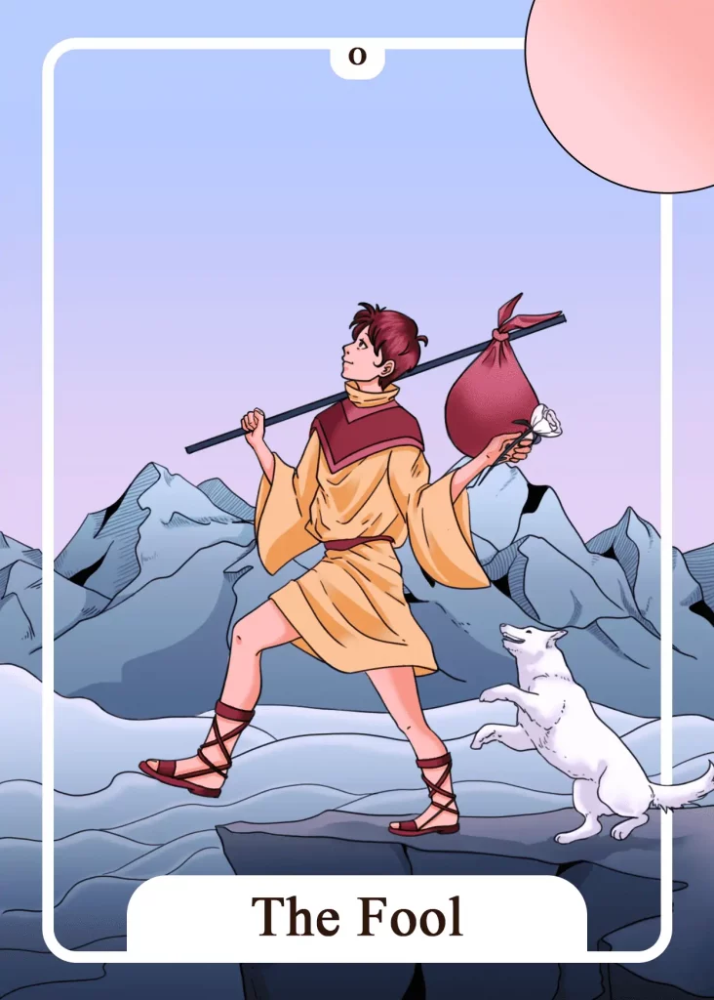

## Meaning
The Fool represents, above all, a new beginning, an opportunity, and untapped potential.

You are, at first, like the Fool at the beginning of your journey, unselfconscious, naive, and free of fears and prejudices, although you are just standing on the edge of an abyss.

Without a clear goal in mind, you simply follow your heart and intuition. You leave doubts and worries behind and trust that your destiny will show you the right path.

Your inner mindset should be similar to that of the Fool, free, curious, and adventurous. Be ready to grow and have new experiences. Leave all doubts and worries behind you and go your way.

Make new experiences. Go different ways. As your reward, spiritual fulfillment and freedom await you.

The Fool Tarot Card encourages you to use your chance for change now. Waiting and hesitating are inappropriate at the moment.

The first step is the most crucial and most difficult at the same time. But once underway, your journey will lead you to unimagined possibilities. You don’t need to be completely prepared for your journey. Too much ballast will only hinder you and make the way more difficult.

Be like the Fool. Take only what is necessary. You do not need more. Feel the chances and freedoms inherent in a new beginning and orient yourself to your inner child.

The latter goes free and unbound new ways to discover the world and make new experiences. Your inner child does not worry about the future but lives in the present and simply feels the urge to explore his life.

Now is the time to give space to your ideas and creativity and share them with your environment. The Fool encourages you to be brave, dare new things, and go out into the world.

The impartiality and spontaneity, as it is still naturally present in children, serve you as a model for your further actions. Your destiny gives you the sign for departure and change through the Fool card. Believe in yourself and trust your own intuition.

