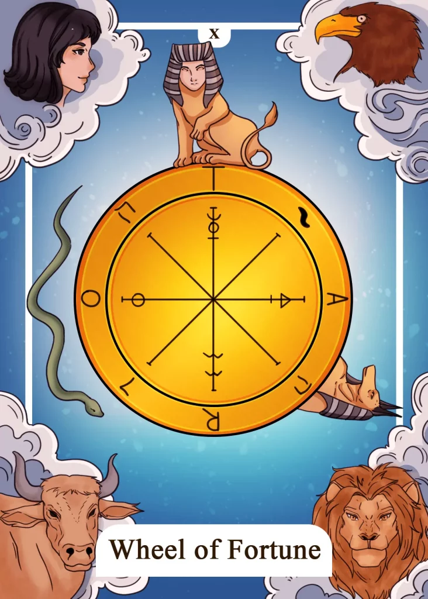

## Tarot Card Meaning
In a Tarot card reading, The Wheel of Fortune is a clear indication of a profound change in your life that is currently taking place. Such changes can unsettle you or have been hoped for by you for a long time.

Regardless of whether we evaluate the upcoming change as positive or negative, it allows us to gain new experiences and to grow with the challenges that come our way.

Because no matter if you are in a phase of happiness or doubt, the Wheel of Fortune keeps turning and will always lead you back to your “normality”.

The Wheel of Fortune Tarot card can also indicate a turning point in life. We are often under the illusion that we have complete control over our lives and daily routines.

That’s why we are easily thrown off course by both positive and negative strokes of fate. By accepting the flow of the world as given and natural, we will be well prepared for sudden turning points in our destiny and grow from them instead of breaking.

Only the karmic law of cause and effect allows you a small glimpse into the future. Keep in mind how your own actions here and now influence your future.

Another aspect of the Wheel of Fortune is the occurrence of chance in your life. Even when you have pre-planned important life events for yourself, there are always external influences that can disrupt your order.

But coincidences can be events in a positive sense. They help you, especially in a stressful phase of life and give you new strength. Coincidence is a companion throughout our lives, teaching us to accept situations as they are and to learn from them.

Chance has no memory. That’s why bad or good messages sometimes show up very concentrated. Therefore, enjoy the good times when they are given to you by fate and learn from the bad times.

### Love: Single
As a single person, the Wheel of Fortune card reveals a change in your love life. New chances to meet someone are imminent, but you must actively use them for yourself to find a new partner.

Be mindful in which areas of your life suddenly changes occur, like in your job or circle of friends. Often you miss your opportunities to meet someone due to carelessness or too much distraction.

The Wheel of Fortune encourages the inquirer to trust more in their destiny. That means not to wait passively for True Love to happen but instead to use the presented opportunities in your everyday life.

Trust that your destiny will reveal to you a multitude of opportunities to discover a new love and try to seize these chances with all your heart.

Another meaning of The Wheel of Fortune is the effect of chance on your love life. Deep friendships and love relationships are often created by coincidences experienced in your daily lives.

However, you will only encounter such coincidences if you actively participate in life and move through the world with an open mind and spirit.

### Love: Relationship
In a relationship, The Wheel of Fortune means that your partnership will take a new turn. Such a change can be positive, such as the birth of a child or marriage, or of a negative nature, such as infidelity or separation.

During the card reading, you will intuitively feel in which direction your relationship will go. The change is not yet complete, so you and your partner still have the chance to counteract it.

The Wheel of Fortune can also mean that your relationship has already successfully gone through numerous ups and downs and you have created your own common destiny.

Such a common destiny binds you very closely together and allows you to overcome the numerous challenges in life together successfully.

### Health

For your health, The Wheel of Fortune means that you should take care of your health right now. That includes regular check-ups with your doctor, sports and a healthy diet.

Because only if you do something good for your health at an early stage, you will stay vital and fit in the future and resilient against diseases.

In addition, the Wheel of Fortune stands for spontaneous recovery from one of your ailments that has been plaguing you for a long time. Such spontaneous recoveries express the overall good health you have built up over the years.

But just as suddenly as recoveries occur, new illnesses can also enter your life if you do not take good care of your body and mind.

### Career

For your job, The Wheel of Fortune card means that there will soon be a significant turn in your professional life. That may include a change to another department or new areas of responsibility that will allow you to expand your skills and potential.

Furthermore, The Wheel of Fortune represents a once-in-a-lifetime opportunity to take up your dream job. Maybe you have been thinking for a long time about a new professional direction, which is more in line with your interests and passions.

Now an opportunity arises to make your dream come true, but you have to seize it in time because it will only be available for a short time.

### Finances/Money

In a financial context, the Wheel of Fortune reveals a considerable change in the future. In which direction remains open. It could be a salary increase, a profit, or a total loss of some of your investments.

In any case, you should increase your nest egg to prepare for all eventualities. Another meaning of The Wheel of Fortune is that you are offered a very promising investment, but it is only available for a short time.

Whether it is your dream car or a tempting piece of jewelry, check before buying whether you can afford your desire. If the answer is yes, you should quickly seize the opportunity.

### Destiny

As a card of destiny, The Wheel of Fortune stands for upcoming turning points in your life that will have a great impact on you. Change is unstoppable, even if it can sometimes be difficult to adapt to new circumstances.

You will be able to grow from the challenges ahead when you are in flow with yourself and your environment.

### Personality
The Wheel of Fortune reveals a personality that takes its destiny into its own hands. Such person does not rely on favorable coincidences but forges his own luck.

In addition, such a character is willing to change his actions and thinking. Thus he can adapt to constantly changing challenges.

### Past
From time to time, you struggle with your fate from days gone by. Don’t be too hard on yourself, but also reflect on the positive aspects of this time.

A chance encounter in your past has turned your life upside down, but you are grateful for it.

### Future
You are facing a decisive change in an important area of your life,. Make the first preparations accordingly.

In the near future, a lot of things will change and you will face new challenges. But you have the opportunity to enrich your life as a whole.

### Yes or No
The opportunity is more than favorable for a yes decision. The combination of different factors is just so optimal that you should not miss this chance.

Because if only one component changes, this can trigger a chain reaction that endangers your choice. Therefore, take your fate into your own hands with a sincere yes.