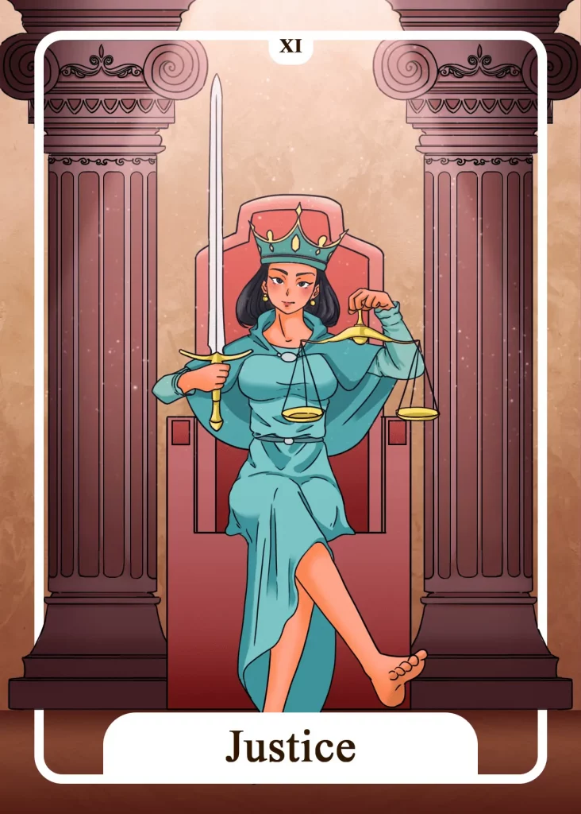

## Tarot Card Meaning
The Justice Tarot card shows that you must take responsibility for your actions. If you are at peace with your decisions and ready to bear both the positive and negative consequences, you will feel fulfilled and pure.

If you have doubts or regrets about your decisions, it is advisable to keep in mind that every unsuccessful judgment will help you in the future to make the right choice for you.

Taking responsibility means that we do not try to escape the unpleasant consequences but endure them and weigh our actions more carefully at the next opportunity.

The Justice Tarot card indicates that injustice done to you will be taken back, like in a dispute with other people. However, fairness does not mean that the dispute will always be decided in your favor.

Fairness is a double-edged sword that has many facets. Often there are solutions in which both parties to the dispute have to make concessions to the other.

But this is what justice is all about. Deciding on a conflict as objectively as possible and both parties doing their part to make amends and deal with each other better in the future.

Once such an objective judgment has been made, we should not question every detail but accept the consequences for us and learn from them.

You may be facing a very important decision in your life, such as a job change or a move. The Justice urges you not to act rashly but to weigh your decision options carefully and prudently.

The Justice encourages you to trust both your logical mind and intuition to the same extent. Only when both head and intuition are in harmony, you found the right decision for you.

Remember that profound decisions in life often have very long-term effects on your everyday life, so take enough time for your decision-making and familiarize yourself with all possible consequences.

The Justice also focuses on seeking the truth, for example in conflicts or in faith. As with important decisions, consider many facets when searching for the truth.

The more you search, the more you will find out how detailed and complex some truths are. In some cases, you will have to correct your views and opinions about certain ways of thinking or people.

### Love: Single
As a single, the Tarot card of Justice reveals to you that a long phase of being alone will end soon. Especially if you have put a lot of time and effort into finding a new partnership, fate will do you justice and let you find new love.

Remember that the karmic law of cause and effect will only do justice to those willing to invest time and energy in their plans. You will find a new love only if you step out of your comfort zone and dare to meet new people and try new activities.

The Justice Tarot card urges you to be very honest about yourself, especially at the beginning of a new relationship, and not try to make yourself more attractive by telling untruths. Building a relationship on truth guarantees mutual trust for both partners in the long run.

### Love: Relationship
In a relationship, The Justice reveals a high degree of responsibility for each other. Make sure that you are there for your partner, especially in difficult situations in life.

If you have made a mistake, do not blame others or your partner, but stand up for your misconduct and make amends. A relationship based on mutual support and no fear of admitting mistakes will consist of deep trust in each other and great stability.

Justice can also express a very balanced relationship, where openness and truth prevail between both partners.

Continue to nurture your good relationship foundation and be a role model for those around you by exemplifying the importance of deep honesty and openness in a relationship.

### Health

The Justice stands for the own responsibility you have concerning your health. Everything we do good for our body now will pay off double and triple later.

That is also true for unhealthy behavior, which is why it is important to observe your routines and habits closely and adjust them if necessary.

Furthermore, The Justice stands for paying equal attention to your body and mind. Dysharmonies in the relationship between mental and physical processes inevitably lead to discomfort and can cause illness.

Doing something good for your body and your mind to keep them in balance, will have a positive effect on your health.

### Career  

In a career context, The Justice reveals that you should pay more attention to your work-life balance. Ask yourself how satisfied you are with the other areas of your life that are not directly related to your work.

It may be worthwhile to consider how you can reallocate your time to pursue your passions. The Justice also urges you to be fair in your daily work. Just because you don’t like a work colleague very much doesn’t mean you should prejudge him.

When conflicts arise on the job, see what part you have in them. Make an effort to resolve the dispute through a fair and unprejudiced approach and thus create a positive working atmosphere.

### Finances/Money  

In a financial context, The Justice stands for keeping your income and expenses in balance. You cannot live beyond your means for a long time, but you have to adjust your needs according to your income.

On the other hand, you should not let your money lie uselessly on the account, but treat yourself to something nice and enjoy some luxury from time to time. In addition, the card of Justice shows how important it is that you deal responsibly with your wealth.

Because your purchases often have a direct impact on your environment (diesel vs. electric), working conditions in other countries or the sustainability of resources (reusable vs. disposable).

### Destiny  

As a destiny card, The Justice stands for striving for balance in life. Try to find your center in life even after difficult events. Listen to your inner voice and it will lead you back to the middle way.

Always weigh all areas in life well against each other to live in harmony with yourself and your environment.

### Personality
The Justice represents a very upright character. He will never take advantage at the expense of others but will always make sure that everything is fair and just.

Furthermore, such a person has a very high sense of responsibility. So everything he says and does is always in accordance with his personal value system so that he also bears the consequences of his actions.

### Past
A certain problem that is bothering you has its cause in your past. As soon as you see through the causality behind it you will find a solution.

A truth from long ago has not lost its validity, so you should orient yourself to it.

### Future
In a future endeavor, you should take good care that everything is done fairly. If everyone follows the rules, you are sure of success.

For everything you say or do today, you must take responsibility in the near future because time does not forget and will eventually catch up with you.

### Yes or No
You consider only one side of the coin and neglect the other side. Such a one-sided view of your question bears the risk that you do not sufficiently consider important details in your decision-making process.

Therefore your answer should be no, at least until you have dealt with your question comprehensively.