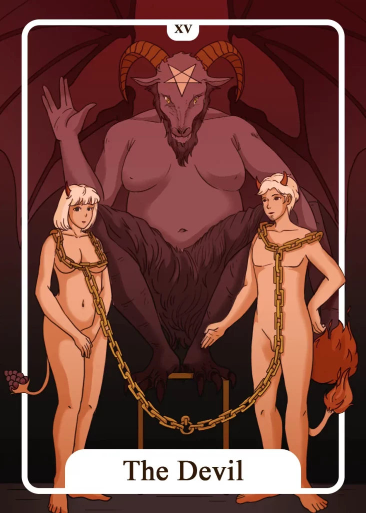

## Tarot Card Meaning
The Devil Tarot Card confronts you with the dark aspects of your life and how they influence you. Instead of suppressing the dark sides, you should face them and look at them closely first.

Where do the desires for sinful behavior come from?

What feelings and needs are being satisfied by my dark side?

If you have found answers to these questions, you can try to transform the dark energy in you into something positive. That happens on the one hand by accepting your dark sides since they are part of being human.

On the other hand, there is always a positive counterpart to every dark side, which must be reactivated, like greed to generosity, jealousy to trust, lie to truth.

In a tarot Reading, The Devil can show us that we are very dependent on material wealth. Whether it is our car or home, wealth is considered a high-status symbol in our society.

But such materialism carries the danger that we make our whole life and self-worth dependent on money and possessions.

When we realize that deep satisfaction and fulfillment come from within ourselves and are independent of material possessions, we will be able to free ourselves from the shackles of materialism.

Inner, happiness-making values such as frugality, modesty and generosity can only arise from within ourselves and cannot be bought.

The Devil also stands for great willpower in a Tarot card reading. Concerning yourself, this means that you can enforce your will and your wishes on those around you.

Therefore, be careful not to harness your environment completely for your needs. Otherwise, other people will gradually turn away from you as soon as they see through that you harness them for your purposes.

Concerning other people, this means that someone is constantly imposing their will on you without considering your needs. Stand firm and free yourself from relationships that only focus on the well-being of the other one.

### Love: Single
In a love Tarot context, the Devil card reveals that you pay too much attention to appearances in your search for a partner. Especially status, wealth and attractiveness are selection criteria for you to meet a new partner.

But the exclusive focus on the material level will bring you only very empty and superficial relationships. Look behind the outer facade of your partner and search for the inner values.

By doing so, you will find a partner with whom you can live together long and contentedly. When The Devil appears in a love Tarot reading, it stands for high willpower and sexual desire.

Through your willpower, it will be easy for you to get to know someone and win them over. Respect the needs and wishes of your partner so that you can have an enriching relationship together.

The Devil expresses increased sexual desire, which you should live out respectfully. As a single, you should experiment with different love experiences to notice which practices you would like to live out in a partnership.

### Love: Relationship
In a partnership, The Devil Tarot card symbolizes serious misconduct of a partner. Cheating on your partner with someone else is one of the most common sins in a relationship, along with financial or emotional exploitation.

The Devil leaves no doubt about how serious the situation is. You are required to quickly and consistently decide whether and how you still want to maintain this relationship.

Another aspect of The Devil card is the presence of pathological dependence in a partnership. Especially when one person sacrifices himself emotionally and materially for the benefit of the other partner, this will inevitably lead to a very harmful imbalance.

If you find yourself in such a position of dependency, you must become more aware of your own needs and desires. Discuss this imbalance in the relationship with your partner and make clear demands regarding your own needs.

### Health  

Regarding health matters, The Devil means that your health suffers from a dependent behavior. Such a dependency can be caused, for example, by the consumption of cigarettes, alcohol or overeating.

The resulting vicious circle makes you cling more and more intensively to the harmful behavior until the body eventually becomes seriously ill. In any case, seek the help of a doctor to take the first step out of the vicious spiral.

If you are suffering from a serious illness, The Devil’s card admonishes you not to let your suffering completely determine your life. Show your willpower by trying to make the best of your life despite your limitations.

### Career  

The Devil Tarot card shows that you feel very trapped in your job at the moment. You have developed a great dislike for your work, but you see no way to improve your current situation.

Realize that you can actively shape your life yourself. Turn your frustration into new motivation by actively looking for new professional perspectives.

Furthermore, The Devil card warns you not to trust certain colleagues or superiors too much and be careful in what you say and do. Superficially, such people promise you the most wonderful things and are already preparing your dismissal behind your back.

### Finances/Money  

In a financial context, The Devil warns you not to be too wasteful with your money and live beyond your means. By accumulating more and more luxury goods, you run the risk of falling into a debt trap from which you will not get out so quickly.

Therefore, keep a close eye on your income and expenses and adjust your lifestyle accordingly. Another meaning of The Devil Tarot card is big money worries that plague you.

Your life is all about how to restore your financial balance. Make a long-term plan on how to reduce your debts step by step and build up a small emergency reserve over time so that your worries turn into hope again.

### Destiny  

For your destiny, the Devil card symbolizes that you should become aware of your dependencies on things and persons.

Because only when you recognize the chains that hold you, you will be able to free yourself from them. That is often a long process, demanding a lot of strength and willpower from you. However, it also lets you mature and become independent.

### Personality
As a personality card, the Devil reveals a very materialistic trait. The person is anxious to accumulate as much wealth and fortune as possible, which are the basis for his well-being.

At the same time, the Devil represents a dependent type of character. Such a person lets his opinions or decisions be determined predominantly by other people.

### Past
In the past, you wasted a lot of time on achieving material goals. Turn your focus back to other values in life.

A sin from the past has caught up with you again. Instead of running away from it, you should face it.

### Future
You make your future too dependent on the needs of other people. See what you want for yourself and shape your destiny accordingly.

Your willpower will be the deciding factor in whether you will be able to realize your upcoming goals.

### Yes or No
Do not be misled by false illusions. A no is the right decision in this case to avert worse damage.

While some aspects of a yes decision may seem tempting, the devil is usually in the details and will show himself with all his destructive power if you succumb to the temptation.