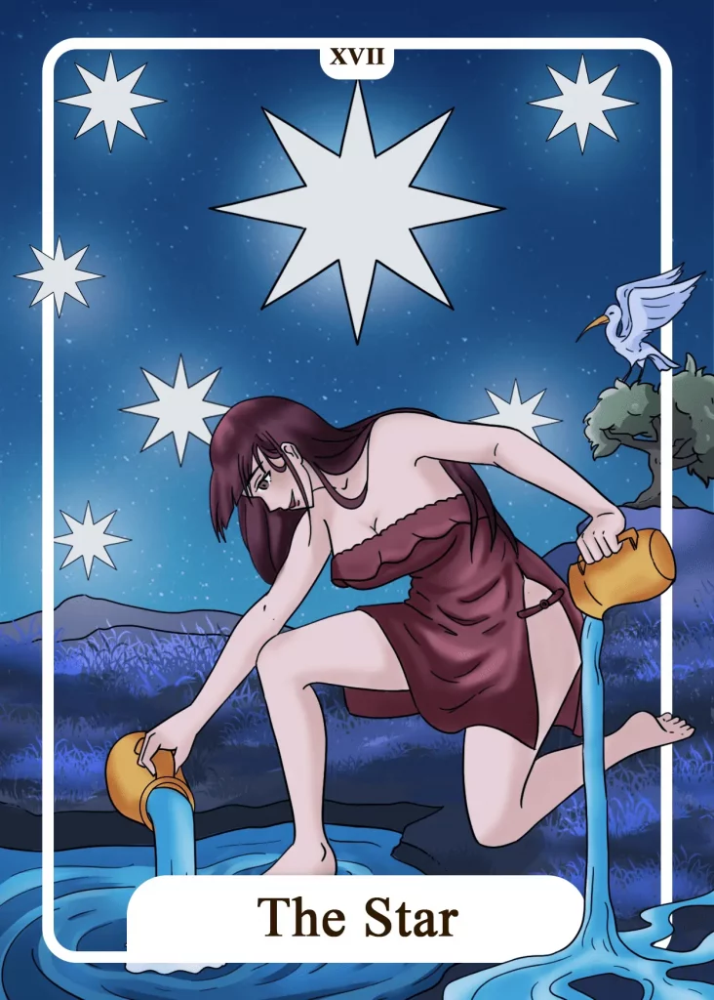

## Tarot Card Meaning
Following the Tarot card of the Tower, the Star reveals new hope and happiness after the previous chaos. Hope is an important quality that helps us not to despair even in difficult times and thus worsen our misfortune.

Instead, hope gives us an outlook to improve our current difficult life situation and thus mobilize our inner forces to persevere.

On The Star card, the two vessels with the flowing water symbolize that hope gives you new energy and makes you realize that in every misfortune lies the seed for a positive change in your life.

Another aspect of The Star is the development of serenity in life. When we no longer care so much about what other people think about us, we can freely and impartially live our lives without shame and fear.

However, this inner process of serenity only succeeds if we learn to appreciate and love ourselves as individuals with all their strengths and weaknesses.

We should not be too self-critical of ourselves and constantly strive to be as some people expect us to be. Otherwise, we will always be tense and narrow-minded, which will prevent our creative development potential from unfolding.

The Star signals an upcoming or existing phase of happiness in our lives. We all long for happy moments with our family, friends or ourselves, where we can recharge our batteries and simply enjoy our lives.

Unfortunately, we often miss such beautiful moments because our thoughts revolve too much around negative aspects of our everyday life. We do not allow ourselves the time to enjoy our happiness.

Try to be more aware of the small moments of happiness in everyday life and look for them. You will then build a good counterweight of positive energy, which makes the small worries of everyday life no longer seem so big.

### Love: Single
The appearance of The Star in a Love Tarot reading encourages you as a single to hope. Especially if you have a long time of waiting or loneliness behind you, opportunities in matters of love will soon arise for you.

You must continue to believe in yourself and keep up the hope of meeting someone for life. That confidence will help you recognize new chances in love and use them accordingly.

Another aspect of The Star in a love context is the occurrence of fortunate circumstances. Often we do not even notice how much luck we have right now, whether a sorrowful relationship has finally ended or that we have opened up new circles of friends.

The more you focus on the positive sides of your life circumstances, the more the universe will reveal to you new moments of happiness in love. It is like a positive cycle at the end of which a wonderful partnership can result.

### Love: Relationship
In a relationship, the star reveals a high level of mutual trust. Both partners have a firm and common foundation of beliefs regarding their views and values. That puts your partnership on a solid basis that is resistant to external influences.

Another aspect of such a relationship is the belief of both partners in true love, whereby the partnership reaches a deep emotional level. The Star Tarot card also shows that your relationship is currently in a harmonious phase, making it possible to realize joint projects excellently.

Especially in phases of great happiness, it is worth consolidating and intensifying the partnership by spending and enjoying a lot of time together. That strengthens the feelings towards each other and further consolidates the foundation of love.

### Health  

Considering your health, the card of The Star means that you can regain hope after a long period of illness. Your body slowly begins to recover and you feel new strength flowing through you.

Looking to your future with confidence and optimism will support your entire recovery process. Furthermore, The Star encourages you to believe in your inner self-healing powers.

Because faith can move mountains, which is also true for your health. No matter how old you are or how you feel, your belief in yourself enables you to actively improve your health and well-being.

### Career  

In a career context, The Star card predicts promising possibilities to improve your professional situation. Your applications will finally bear fruit and you will have the chance to finally get your dream job.

You may also have the chance to move up the career ladder within your company. Take advantage of the opportunities that are present and success will soon follow.

Furthermore, the Star encourages you to deal more calmly with the requirements of your work. That means that you should not lose your head immediately when problems arise but that you should devote yourself to finding a solution with calmness and patience.

### Finances/Money  

In a finance Tarot reading, The Star means that now is a good time to make deferred investments. Either invest your money wisely so that you can provide for your old age, or treat yourself to a new purchase from your savings, which you have wanted for a long time.

In addition, The Star Tarot card means that a blessing of money will soon await you. That can come in a variety of forms. On the one hand, it could be in the form of a salary increase, and on the other hand, in the form of a one-time monetary win.

In any case, you should use this fortunate coincidence to further strengthen your financial cushion and provide for difficult times.

### Destiny  

For your destiny, The Star shows that you have a happy future ahead of you. If you always have faith in yourself and your potential, you will be able to master any challenge in life, no matter how difficult.

In addition, the belief in your own luck magically attracts positive experiences that enrich your life in many ways.

### Personality
The Star represents a personality that always keeps hope in its heart, no matter what challenges he faces. His confidence also radiates to his fellow men.

At the same time, the Star expresses a very serene character. Nothing can upset this person so quickly, as he rests firmly within himself.

### Past
Through your past experiences in life, you have learned to take many matters calmly because you know that often everything turns out well.

You still live on a past event, which gave you great luck. Use this positive energy for your everyday life.

### Future
You firmly believe in a positive future because you have recognized that you are the creator of your destiny and can influence it in your sense.

Your hope for the fulfillment of a life dream will soon come true. Keep your confidence even if your way should be rocky.

### Yes or No
With a yes, you are connected with the hope that everything will change for the better in this question.

Your belief in this alone can move mountains, which is why you should definitely give a positive answer. You don’t really have anything to lose, but on the contrary, you can gain a lot.