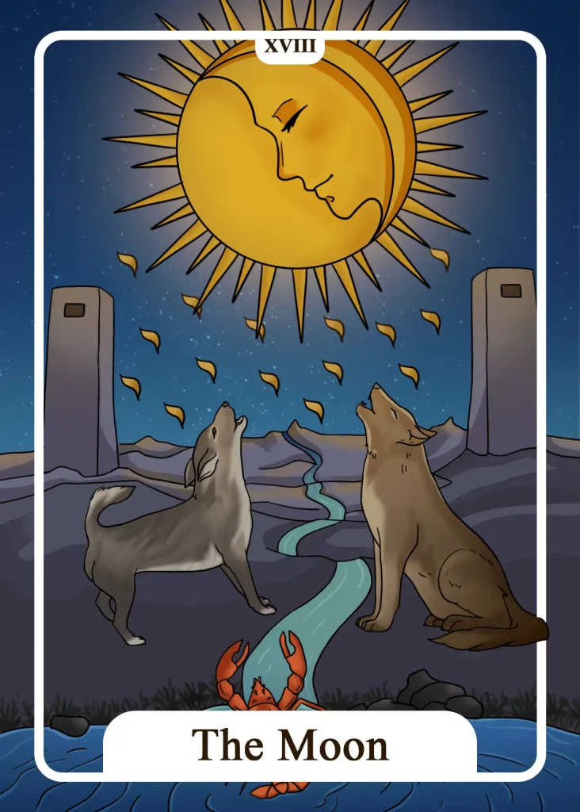

## Tarot Card Meaning
The Moon Tarot card indicates a period of anxiety and uncertainty. Great plans and projects you have begun are fraught with unexpected difficulties and threaten to fail.

The fear of failing or not being enough prevents you from counteracting adequately. Get clear about your fears and involve other people in your difficulties by asking them for help.

Together you will be able to bring light into the darkness and thus dispel the fear of uncertainty and failure. Be brave and dare to face your fears, so they lose much of their terror.

Another aspect of the Moon card symbolizes the illusions in our lives. Delusions prevent us from looking the truth directly in the eye and are sometimes very difficult to see through.

We can build very powerful illusion castles for ourselves, which we defend to the last. The strongest illusions take place exclusively in our heads.

Regularly check your attitudes or evaluations towards people or situations and see how others think about them. If you can break down the walls of your delusion castle and get rid of your illusions, you will find how multi-layered, complex and fulfilling the truth can be.

The Moon also shows us that you should rely more on your intuition and premonition. Be aware of the lunar cycle when you draw The Moon during a tarot reading.

During New Moon, you should use your imagination to plant the seeds for new projects and dreams, which will be realized over time. You should listen well to your inner feeling, which will help you decide which projects have the best chance of becoming real in the future.

On the other hand, during the Full Moon, it is helpful to look at the goals you have achieved so far in your life and simply enjoy these successes. Pay attention to your feelings. Maybe it’s time to change direction again regarding your achieved goals.

### Love: Single
In a love Tarot reading, The Moon reveals a great fear of a new relationship. As a single, you have already found your way to live alone and arrange your daily routine freely.

You don’t want to be alone anymore, but the idea of having a new partner who will mess up your life alone scares you. But keep in mind that the fear of the unknown also denies you the many beautiful and pleasurable moments of a new partnership and ultimately condemns you to loneliness.

Often it can be helpful to imagine what a new love will give you instead of what it will take away. Through this image, which you keep inside yourself, you can freely meet new people and feel quite quickly whether you have an inner connection or not.

However, don’t deceive yourself about your choice of partner by creating a perfect but unattainable ideal in your mind. Rely on your intuition when you are with someone new and feel the harmony between the two of you.

### Love: Relationship
In a relationship, the Moon Tarot card reveals that you have illusions about your partner. On the one hand, you may idealize your partner too much and protect him against everything and everyone, although this is not justified.

On the other hand, you may want to change your partner to fit an ideal image you have in your head. In both cases, you should try to get an honest and realistic picture of your relationship, like through hints from outsiders or through good self-reflection.

Fear about the future of your own partnership is also an aspect of the Moon Tarot card. Especially after a serious quarrel or a longer period of emotional cooling down of both partners, the worries regarding the common future are great.

But before such fear takes over and determines your everyday life, you should courageously go ahead and talk honestly with your partner about your fears so that both of you can find a way out of this crisis.

### Health  

The Moon Tarot card stands for anxiety and depression in a health context. Such symptoms creep into our daily lives unnoticed at first and grow in magnitude if we don’t notice them.

As soon as you notice that symptoms like apathy or fear paralyze you in your everyday life, you should definitely seek help from friends or doctors.

Furthermore, The Moon stands for using your intuition to recognize symptoms of illness at an early stage. Perhaps, you have had an inner premonition for some time that something is wrong with your health. Clarify your fears early so that you can prevent serious illnesses.

### Career  

When The Moon appears in a career reading, it warns you not to close your eyes to grievances in your job. Mobbing or exploitation of colleagues is often concealed to protect the working atmosphere.

But if you dare to open your eyes and talk to others about the grievances at work, you can bring about some positive change. In addition, The Moon can indicate that you feel great insecurity and fear concerning your professional future.

Maybe there is a wave of layoffs in your company or your last appraisal interview has given you a reason to worry. In any case, you should take your professional future actively into your own hands by preparing applications and further education.

### Finances/Money  

Concerning your finances, The Moon encourages you to rely more on your intuition. Listen to your inner feeling before making a major financial decision for yourself.

A bad feeling warns you not to make a hasty investment and rather wait a little longer. If your mind and heart give you green light, you can venture into new financial investments.

Furthermore, The Moon shows that you are afraid of your financial future. Your income may not be stable enough to plan far into the future. Try to create a savings plan to be prepared for unexpected expenses and to be able to sleep more relaxed.

### Destiny  

For your destiny, The Moon card means that many deceptions will accompany you on your life path, which will be quite frightening.

Use your intuition to get through the fog of illusions in one piece and stay on your path. With increasing experience, you will be able to distinguish more easily between illusions and the truth.

### Personality
As a personality card, the Moon reveals that inner fears dominate a person’s life. The fear is not so much related to external phenomena but internal ones.

Furthermore, the Moon shows someone with a good sense of what is about to happen. Such premonitions are an expression of a deep connection with one’s intuition.

### Past
You are still subject to certain illusions from past times. As long as you do not see through them, they will continue to plague you.

Sometimes you are afraid to face your past. Dare to face your fear and it will lose its terror.

### Future
Use your imagination to create your future in your mind today. Such first mental drafts are the cornerstone for your dreams to come true in the future.

Lately, you have a strong sense of foreboding about things to come. Trust your intuition completely.

### Yes or No
Deep inside, you already have a premonition that the answer must be no this time. Too many things are hidden and cannot be estimated with your question.

Reasons that speak for a yes are mostly dubious and turn out to be sham arguments on closer examination, to which you should not attach any weight.