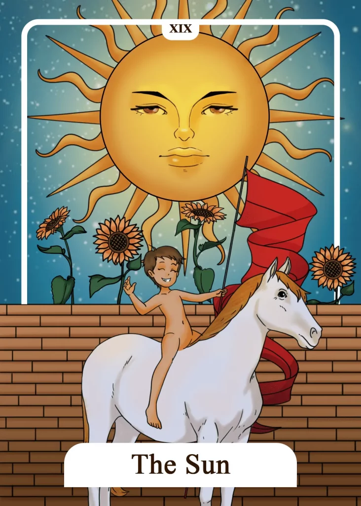

## Tarot Card Meaning
The Sun Tarot card represents boundless optimism and positivism. Especially if you have just had a difficult time, the Sun signals that positive change is imminent.

The rays of the sun illuminate the path ahead and give you the strength and drive to continue on your way of life through its warmth. Use this optimism to realize projects that have been put off for a long time.

Because through the sun even the most challenging projects will bear fruit and flourish. If you live out your positivism, you will find that it will also affect your environment.

You, like the Sun itself, will pass on your positive power and charisma to other people. That way, they, in turn, will experience much happiness.

Another aspect of the Sun card is its tremendous vitality. You feel full of energy and could pull out trees. Use this vitality and express yourself by doing sports or just enjoying your body.

Your life force will have a lasting and positive effect on your health. In case of an illness, you will now experience a substantial relief of your suffering, triggered by the life-affirming core of the Sun card.

As we all know, healing starts in our head by firmly believing in our self-healing powers and then transfers to our body.

The Sun gives you new insights which were previously hidden. Its rays illuminate insights that were in darkness. That often happens quite suddenly without you having expected it.

This experience can be very intense and overwhelming at the same time. Especially if you have been struggling with a problem for a long time or are stuck in a personal dead end, a solution or a path will suddenly reveal itself and bring you decisively further on your life path.

Such realizations are often connected with a warm, happy feeling, just as the sun does us well with its rays on a summer’s day.

### Love: Single
In a love Tarot reading, The Sun promises you great luck and success in your efforts to find a partner. With a positive outlook on life and an optimistic attitude, you will recognize that other people are attracted to you, as they find your closeness very beneficial.

You will get many opportunities to meet a new soul mate, which will allow you to see which person suits you best. Use your current positive energy to share it with another person and you will both have a happy time together.

The Sun encourages you to use all aspects of your body to find your ideal partner. That means keeping yourself physically fit and active, as well as working on how to present yourself more attractively on the outside.

Pay attention to your inner attitudes and always be positive and optimistic. Because this way, your body will adapt to your inner attitude and you will appear much more present and vital to your environment. Let your joie de vivre shine outwardly and inwardly. Thus love will flow into your life almost by itself.

### Love: Relationship
In a relationship, The Sun reveals a great fit with your partner. Your common plans as a couple, be it starting a family or building a house, will succeed despite resistance and form a stable foundation of your relationship.

Now is a good time to set new goals, as you are forming a great team that can accomplish anything together. By sharing and experiencing happy moments together, you will experience deep satisfaction in your partnership, which is granted to only a few couples.

The Sun is a sign that you have received a deep insight into the mystery of True Love, which is difficult to describe with words. Rather, it covers deep feelings and a kind of shared intuition, in that you often experience the same thoughts and emotions as your soul mate.

You both share a deep spiritual feeling of love, which in turn ensures that you radiate optimism and contentment to those around you and thus let them participate in your True Love.

### Health

The Sun Tarot card expresses vitality and zest for life and stands for excellent health. To maintain this, you should continue to do good to your body and mind to be prepared against emerging diseases.

Furthermore, The Sun signals that you will soon recover from a serious illness. Don’t give up hope and make the best out of your situation despite the still existing symptoms.

A positive attitude towards life will help you to reactivate hidden self-healing powers. This way, you will soon feel a new energy in you, which will help you to fight your illnesses.

### Career

In a career context, the Sun Tarot card means that you have reached new insights that influence your work. Perhaps you have been instrumental in advancing a major project with your ideas, or you have qualified for higher positions through various training programs.

Seize the opportunities that present themselves and continue to climb the career ladder. In addition, the Sun Tarot card indicates great professional success coming your way.

Through your positive attitude towards work, you will inspire not only yourself but also your colleagues for upcoming tasks. That makes your job easier and you can turn even the most difficult challenges into success.

### Finances/Money

Concerning your finances, the Sun card shows a positive development of your money. Any outstanding debts will be settled soon and your income will grow steadily year by year.

Use this development wisely by putting something aside for bad times or simply treat yourself to purchase for your well-being. Furthermore, the Sun stands for great financial success, which is granted to you.

That can be a bonus for good work performance or that you are finally rid of a large debt burden. In any case, you should be happy about what you have achieved and set goals for your next success in the future.

### Destiny

As a destiny card, The Sun promises that your plans will be successful. That also includes a positive attitude towards yourself, through which you will be able to fully exploit your inner strength.

Your life-affirming charisma will also fascinate other people around you so that you can count on a lot of support in the realization of your goals.

### Personality
The Sun symbolizes a success-oriented personality. The person takes even failures as an opportunity to learn from them the best for his next plans.

In addition, the Sun is associated with a character who always looks positively at the world. Such boundless optimism leads to the person having a high basic satisfaction in life.

### Past
Think back to your successful times. From them, you can derive many valuable insights for your next undertaking.

Your vitality of the past months will continue to pay off for your well-being and let you go about your daily life calmly.

### Future
You are facing a time of true realization regarding important life issues. You are experiencing true enlightenment in some areas that will move you forward.

You also have an unshakable optimism about your future. Your positive attitude will open many doors for you.

### Yes or No
A clear yes answer promises a successful endeavor. You are beaming inside just thinking about the many positive possibilities associated with your decision.

A few residual doubts still keep you from giving a yes. But with your positive energy, you can quickly dispel these worries.