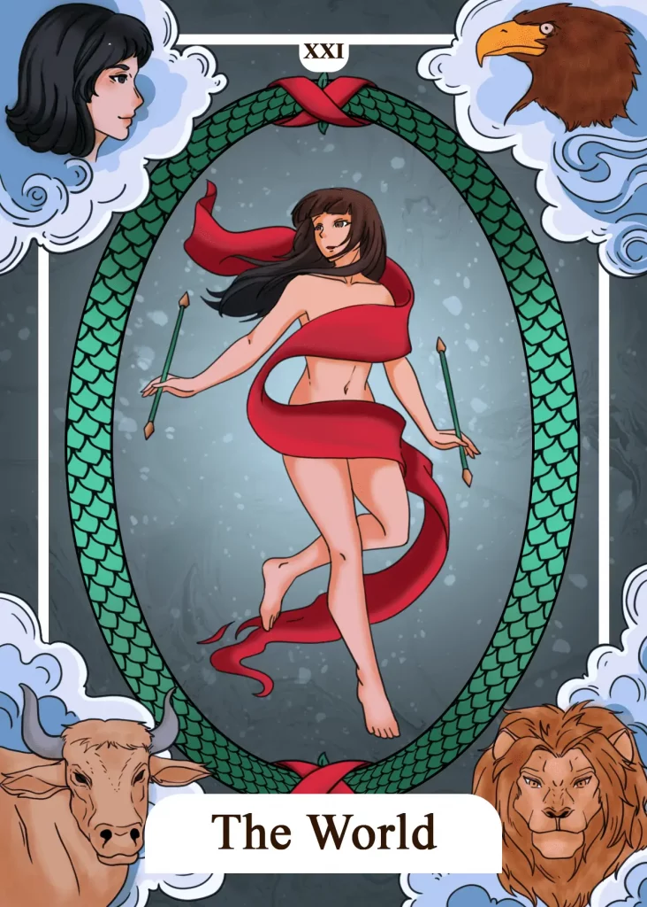

## Tarot Card Meaning
The upright World Tarot card reveals that you have successfully completed a crucial phase in life. Be it an apprenticeship/study or an important project at work, your efforts and perseverance have now paid off and everything has gone as you had imagined.

You have brought about the fulfillment of these cycles yourself through your dedication and willingness to make an effort so that you can now reap the fruits of your labor.

Calmly look back on the path that lies behind you and make yourself aware of the ups and downs you had to overcome to now be at your destination.

The World encourages you not to stand still but to look for new challenges in life to grow inwardly. By actively participating in the life around you, you will keep learning and living in harmony with your environment.

Thus, as in the Fool’s journey, there are always short pauses in life, but never a final standstill. Once you have mastered one station in life, the next is already waiting for you and will reveal a deeper understanding of the world and yourself.

Another aspect of the World Tarot card is the integration of different attributes that make us into one. Often we struggle with ourselves and are dissatisfied with our body or some of our character traits.

If you manage to build up a positive and appreciative attitude towards yourself, you will learn to love yourself more and to understand yourself better as a whole person.

Especially our small corners and edges make us the person we are. Through your acceptance of your inner being, you will live in harmony with yourself, which in turn radiates to the entire cosmos.

### Love: Single
In a love Tarot reading for singles, the World card finally reveals a breakthrough in your search for love. You have been through some ups and downs in your single life so far, but soon a new relationship will reveal itself at the end of your path.

That person can be a longtime friend with whom you have developed strong feelings and who reciprocates these emotions in different ways. Take the final step and reveal yourself to your love.

You will simultaneously take the first step into a new and enriching relationship. The World Tarot card reveals that you have a great longing to become a member of a greater emotional unity again.

Such unity is most likely to be achieved by entering into a partnership in which mutual appreciation and emotional affection allow you to experience True Love.

The World encourages you to hold on to your dream of a fulfilling partnership and to go in search of a soul mate to satisfy your longing for shared love and intimacy.

### Love: Relationship
In a relationship, the World card reveals that you have succeeded in complementing each other’s qualities and appearing as one. Instead of wanting to change the other partner, you respect each other as individuals with all your rough edges.

That makes it possible to integrate even unpleasantly perceived qualities of the partner into the relationship and value them as part of the partnership. The World Tarot card reveals that both partners have reached a level of love that only a few couples reach.

In good and bad times, you have walked together through all the valleys and mountains, always supporting each other along the way.

New challenges still await you, but you can face them calmly because you form a unit as a team and can draw on your immense wealth of experience from past “journeys”.

The World symbolizes that a long-planned project in your relationship will soon bear fruits. Through your perseverance and cooperation, you can soon enjoy your results.

### Health

Regarding your health, The World encourages you to balance your physical and mental well-being. Positive thoughts affect your physical health, while a vital body affects your mental well-being.

Exercises promoting physical and mental well-being, such as yoga or meditation, are well suited to create holistic well-being. In addition, the World stands for a permanent integration of health-promoting behavior in your everyday life.

By establishing certain routines, such as taking the stairs instead of the elevator or eating fresh vegetables once a day, your health will greatly improve or be maintained in the long run.

### Career

When the World appears in a career reading, it means you’ve finally achieved a long-awaited professional goal. If you’re employed, it means a promotion you’ve been working towards for a long time.

If you are self-employed, it may mean that you have passed the first strenuous phase of building your business and can finally take off. In addition, the World Tarot card encourages you to find a good balance between your work and your private life.

Balancing work and family life can be made much easier even with a manageable reduction in hours. There are also more and more opportunities to work from home. Find out what is possible in your industry and take advantage of the opportunities.

### Finances/Money 

Regarding your finances, the World card stands for the completion of an important milestone for you. That can be a finally paid-off loan or a salary increase you have been working towards for a long time.

Enjoy your successes and use them as motivation to set new goals that will further consolidate your prosperity. The World Tarot card encourages you to look for new ways to stay financially independent.

There are many ways to earn a little extra income besides your main job, which will give you a solid financial cushion over time. There are no limits to your creativity (Tarot card reading, making music, blogging) and you have the opportunity to acquire new knowledge.

### Destiny 

Regarding your destiny, The World means that you are finally achieving a long pursued dream. Your efforts are now paying off in more ways than one, giving you a deep sense of satisfaction.

But the end of one cycle is also the beginning of a new one. Therefore, set new life goals and pursue them with the same zeal so that you can enjoy them.

### Personality
The World stands for someone who strives to integrate all his strengths and weaknesses into his everyday life in a meaningful way. This person is concerned with accepting himself as he is and not as others want him to be.

In addition, such a character strives to complete everything he starts to perfection. There are no half-measures, but everything should correspond 100% to his ideas.

### Past
A journey into the past can reveal new insights to you. Use your imagination or visit places/people that once meant a lot to you.

Try to integrate difficult phases of your life into your overall biography. They have often brought you to your limits and thus revealed your enormous potential.

### Future
Shortly, you will complete an important goal in life. For this, you only have to continue to believe in yourself and use all your strength for your project.

Furthermore, something divided in your life will reunite as one. Thus, the corresponding elements will be more connected than ever before.

### Yes or No
A yes answer will bring you full circle and leave you with a deep sense of accomplishment. The respective advantages and disadvantages of a yes decision wonderfully complement each other so that you can confidently stand behind your choice.

By answering your question, new possibilities for moving forward will open up again.

