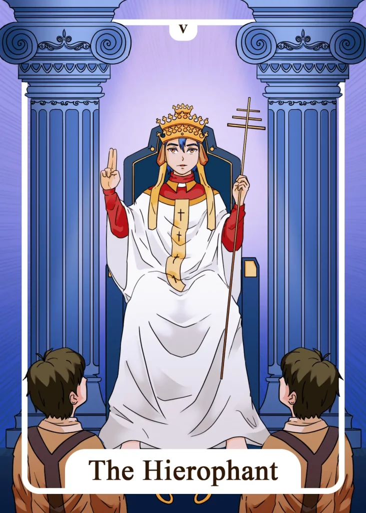

## Tarot Card Meaning
The Hierophant Tarot card stands for a firm system of values and beliefs in your life. Like a guideline, your value system runs through your life, helps you to stay on your path and gives you support and structure in everyday life.

Your faith, both religious and spiritual, has been strengthened over a long time and is an endless source of energy and creativity for you. The Hierophant reveals that a path to spiritual and religious growth requires the help of a teacher at the very beginning.

You can learn a lot from your teacher, by trusting in his deep insights and wisdom. He will also bring you to your own insights faster than if you search for spiritual wisdom only for yourself.

You can meet such a teacher on many occasions, not only in religious or esoteric communities. A teacher can also be a good friend, your own partner, or even children.

If you have internalized a belief system for many years and have acquired immense knowledge or a wealth of experience, you can also take on the role of a teacher for other people.

The card of The Hierophant shows you that you are ready to pass on your knowledge to others. Structure your knowledge carefully and reflect on the original principles of your wisdom. Then you will be an inspiration and authority in the spiritual field for other people.

But as a teacher, you have not finished learning. On the contrary, you must not lag behind your students in your efforts to acquire further knowledge but must lead by example.

For this, it is helpful to deepen your own studies. The roles of learner and teacher are only two sides of the same coin and can change at any time. The Hierophant stands for the living out of traditions, especially in a community.

As part of a religious community, you follow the rules and traditions that prevail there. That creates a deep sense of unity and connection with your religious community.

For everyone to benefit from the community, the rules there must be respected and followed. If you are not yet part of such a community, The Hierophant invites you to try out such a group experience, like in a religious community, sports, or cultural club.

Your own family or circle of friends can also serve as supportive communities in your life. By performing common rituals and traditions, such as Christmas or a marriage, you will experience deep feelings of connection and unity in the group, which will bring much joy and happiness to all involved.

### Love: Single
The Hierophant in a love tarot context indicates a great need for conformity. In your partner search, you want to finally find your so-called “soulmate”, someone very similar to you in terms of your beliefs and values.

It is best to look around in your own religious or spiritual communities to find such a partner. There are plenty of people there who have similar strong spiritual values as yourself, so you already have a deep level of understanding of each other that connects you.

The Hierophant always strives to expand his knowledge. Take him as an example and expand your knowledge in the area of love. Look in which areas of your love or flirt life you have deficits and expand your knowledge through books, videos, or discussions with good friends.

### Love: Relationship
In a relationship, The Hierophant reveals how you can connect even closer to your partner, through the creation of shared rituals and traditions. Many important life events recur at regular intervals, such as birthdays, Christmas, or family celebrations.

They allow us to grow together again as a unit through joint planning and participation. Take time to talk about your shared traditions and most importantly participate in them together.

Embark on a journey together to learn more about yourselves and your love. Expand your knowledge of your relationship and feelings.

To do this, you can take time out from your daily routine and go on a romantic journey for two or set aside a fixed time in your daily routine.

The Hierophant shows how important rules and structures are in your relationship. However, these only work if you set them up together with your partner and you both orient yourselves to them.

### Health

For your health, the Hierophant Tarot card means that you should rely more on traditional medicine in case of an acute illness. Whether these are western or eastern methods of treatment is of secondary importance.

The most important thing is that you firmly believe in their effectiveness. Furthermore, The Hierophant encourages you to expand your knowledge about increasing your well-being.

By dedicating yourself to new health topics and expanding your knowledge about them, you will soon be able to feel the positive effects of your studies on your own body.

Become your own health expert. You will be able to use your knowledge for your recovery at any time and you will not have to sit in waiting rooms for hours.

### Career

For your career, The Hierophant encourages you to expand your knowledge and skills. Inform yourself about different further education possibilities or undertake an educational journey.

The higher your level of knowledge in your field is, the better are your chances to climb the career ladder. Furthermore, The Hierophant indicates that you should conform to current work practice.

New innovations or deviations are important in the job, but first, the basic work must be done reliably. Therefore, make an effort to do the tasks that are expected of you.

The workflow will become more fluid and harmonious by following the tradition of your company in the way you work.

### Finances/Money

In financial matters, The Hierophant stands for a conservative investment. Safe investments like savings books or fixed deposit accounts have proven themselves even in turbulent times, which is why they give you good security with a small profit.

For new financial transactions, you should involve a proven financial institution. Advisors being in business for a long time will not offer you double-digit interest rates, but they will present products that have already helped many savers.

Furthermore, The Hierophant encourages you to increase your knowledge about your finances. Buy an appropriate book or inform yourself in online courses about new or proven developments in the financial world.

### Destiny

For your destiny, The Hierophant Tarot card means that you should always learn without losing sight of the past.

Expand your knowledge and abilities and you will discover the great wisdom of the universe. Thereby you can use a lot of knowledge from the past for the positive creation of your future.

### Personality
The Hierophant stands for a very religious person. Their faith plays a central role in their life and is the starting point for many important decisions and actions.

In addition, the Hierophant characterizes an immense quest for knowledge. Such a person is not satisfied with simple answers but wants to understand everything to the smallest detail.

### Past
You should bring out past knowledge from time to time. That will help you to find new solutions for some problems.

Reflect on long-forgotten traditions and try to integrate them into your everyday life. Often they still have real magic about them.

### Future
Your belief in a better future will be instrumental in shaping your destiny. You will be amazed at what you can achieve.

Try in the future not to assert your head only, but to strive for conformity. In this way, you can create a harmonious coexistence.

### Yes or No
The reasons for a yes are that you firmly believe in yourself and your inner strength. You have even taken negative aspects into account and are convinced that you can cope with them.

Your faith can truly move mountains. Because of that, you should now courageously go ahead and put your decision into action.