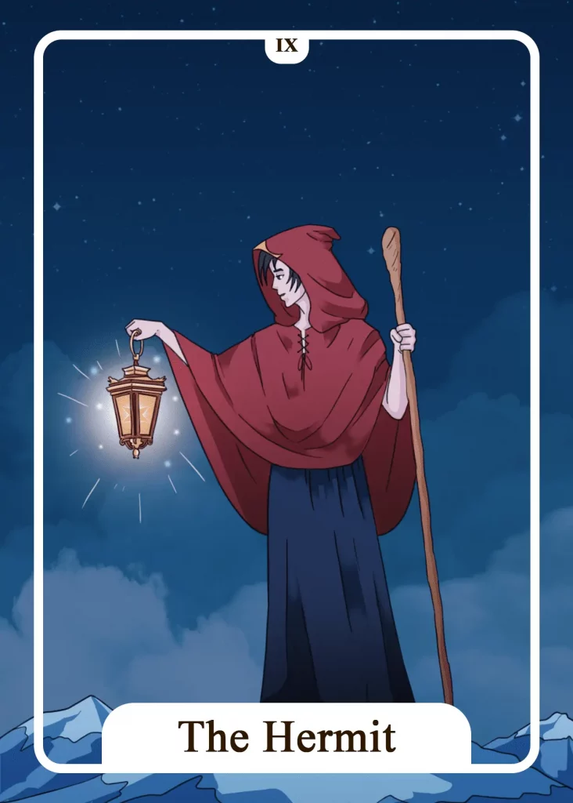

## Tarot Card Meaning
The Hermit indicates that we need a period of standstill and retreat. In a fast-paced and rushed world, there is often a lack of reflection on our inner values and goals.

The Hermit Tarot card encourages us to consciously retreat from everyday life for a while and make a conscious effort to mature within ourselves. You can do such a type of retreat daily through smaller periods of meditation, like in yoga and tarot.

You can also take a journey that helps you further understand your innermost being, like a time out in a monastery or pilgrimage.

Through these forms of retreat, you will be able to receive answers to important questions in your life and your path to spiritual maturity will become more clear.

The Hermit also symbolizes the turning away from a predominantly material way of life to a life filled with inner wealth. Often we see celebrities who own several mansions and millions of dollars but are deeply unhappy due to inner emptiness.

These people often lack a sense of their inner desires and needs. They are under the illusion that through money all needs can be satisfied. But only if we dare to go on the arduous path to self-awareness like The Hermit, equipped only with the bare essentials, will we realize how we can attain deep and lasting happiness in life.

The Hermit is equipped only with the essentials for his journey, foregoing any ostentation or luxury so that he can concentrate entirely on himself.

Another aspect of The Hermit is that you have found an important spiritual teacher in your life. At certain stages of your path to spiritual maturation, it is good to have someone experienced by your side to guide you on your way to knowledge.

Such a teacher can reveal himself in many persons and sometimes does not even know how much he supports you.

Children, for example, are extremely good teachers because they do not brag about their knowledge but are still naturally in touch with the world and can show us some valuable things that we adults have often forgotten.

A good teacher does not try to convince you of his way but encourages you to stay on your path of wisdom and acquire your own knowledge.

### Love: Single
In a love tarot context, the card of The Hermit indicates a great need for time alone. As a single person, this means to take distance from a hasty relationship. Instead focus on your questions and their answers regarding your life.

You can venture into a new relationship when you have found the answers to your questions. As with The Hermit, the path of love is often rocky and sometimes arduous, but it teaches you inner perseverance and endurance.

Every love life has phases where you are in a relationship and times by yourself. Jumping from relationship to relationship prevents you from calmly reflecting on the ups and downs of your previous partnerships.

In this kind of contemplation, valuable insights often reveal themselves to you, which can help us a lot for your next relationships.

### Love: Relationship
In a relationship, the Hermit card encourages us to further search for facets of love. Go on a journey together to discover new aspects of your love life and keep your partnership intact and fresh.

As soon as there is nothing new to discover in a relationship, it falls asleep and loses all its charms. But if you remain curious to discover something new in your partner or yourself, your partnership will be rich in passion and satisfaction.

In a phase of stagnation, The Hermit encourages us to seek advice from a teacher to live a fulfilled relationship again. Such a teacher does not necessarily have to be a person. Books, videos, or blogs can help you to gain further experience in sexual and relationship life.

The Hermit expresses that one part of the partnership needs some space at the moment. This desire for space is quite natural and should be respected in any case because every person needs phases of being alone.

### Health

The Hermit stands for a phase of turning away to activate your self-healing powers again. Take time out from the obligations of everyday life and consciously pay attention to the processes in body and mind, which help you live a healthy life.

Such a time-out can consist of a weekend getaway, or a daily break reserved just for you. Furthermore, The Hermit stands for a long-lasting illness, to consult an experienced healer who can show you new ways to recover.

This teacher should combine knowledge from conventional medicine and alternative healing methods. That way, he can develop an individual treatment strategy with you.

### Career

In a career context, the card of The Hermit encourages you to take a longer break from your job. You can do this in form of a sabbatical or a reduction of hours.

That gives you the possibility to dedicate yourself to other areas or dreams of your life, which have been neglected so far. Furthermore, The Hermit can indicate that you are longing for a new professional challenge.

Look specifically for new job opportunities that are better suited to your skills. Coaching by a consultant can also give you some clarity concerning your future career. A consultation can also positively enrich your work with new ideas and motivation.

### Finances/Money

The Hermit Tarot card admonishes you to reflect once again on your relationship to material possessions. Money alone is not everything in life. Once you realize this truth, you will be able to find happiness independent of material riches.

A complete renunciation of money is certainly not possible, but you alone decide what priority it should have in your life. Furthermore, it can be helpful to discuss your financial matters with an advisor who has many years of experience.

This way, you can learn a lot more about how to best invest your assets and have more time to focus on other areas of your life.

### Destiny

As a destiny card, The Hermit reveals that you are facing a phase of inner contemplation and search for meaning.

Existential questions will occupy you throughout your life, the answers to which you alone will be able to fathom. Be a light to yourself in the darkness of illusions and follow your path to knowledge.

### Personality
As a personality card, the Hermit shows a person who prefers to be by himself and enjoys solitude. He always needs a place of retreat to pursue his thoughts and feelings.

In addition, the Hermit is an expression of a character who is always in search of deeper knowledge. For this, he seeks many teachers in his life from whom he can learn wisdom.

### Past
You long for the solitude of days gone by when you could focus more on your own needs.

In your past is the answer to an urgent question. However, you have to search very persistently for the solution.

### Future
In the near future, you should give yourself more space to enjoy silence. Plan fixed time-outs for this.

Soon you will have a meeting with an important teacher. Such a person can also be someone close to you, like a friend or a child.

### Yes or No
To avoid disappointment, you should rather tend to no. Some important aspects have not been thought through to the end but have a great influence on your question.

It is better to go back and weigh the costs and benefits of your choices. Later you can answer the question again for yourself.