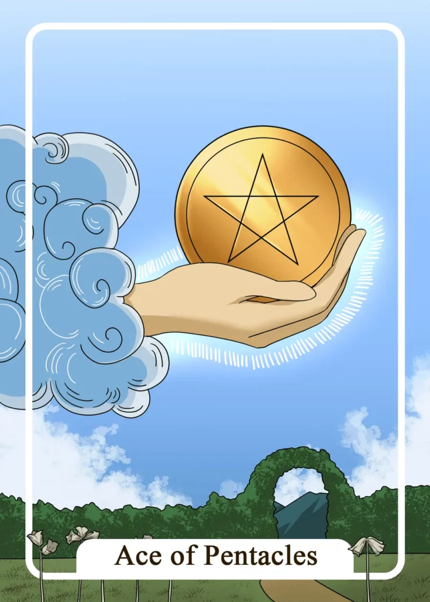

## Tarot Card Meaning
The Ace of Pentacles Tarot card means that you have a promising opportunity in your life, which you should definitely take advantage of.

This new opportunity can manifest both in your personal and professional life and has the potential to bring you many benefits and relief in the long run.

However, this opportunity can disappear just as quickly as it came, so you must hurry to seize it.

The road to realization will have some ups and downs, like a mountain hike. At the end of the road, you will be satisfied to have made the right decision for your life.

Another aspect of the Ace of Pentacles represents prosperity in your life, which will continue to grow and prosper. This means not only material wealth but also family, love and inner contentment, which will make you deeply fulfilled and happy.

Inner prosperity cannot be acquired with money but requires your own effort and a positive inner attitude.

By not only focusing on material wealth and turning to your inner treasures to a greater extent, happiness is also guaranteed in the long run.

Having a functioning partnership, loving family and a positive self-image are worth much more than all the material treasures of this world and contribute to your happiness being independent of financial riches.

The Ace of Pentacles encourages you to manifest your dreams and desires in the real world. At the same time, you should always keep in mind your goal, which you would like to achieve, to tread the right path.

However, it is just as important that you proceed quite pragmatically in the implementation of your dreams and let your thoughts become reality.

The most beautiful dream for wealth remains only an illusion if you are not willing to invest time and energy to make it real.

Therefore, gather your courage and your drive and make a concrete plan. Implement your thoughts in concrete pragmatic actions, so that you can achieve your set goal.

### Love: Single
As a single, the Ace of Pentacles reveals to you that right now you have many opportunities in your environment to fall in love anew.

Be it in your job, circle of friends or your hobby, in all these areas of your life, some people appreciate you very much. Here the potential of a new love relationship exists.

Do not wait too long and use the chance to invite someone from your environment for a date. Test out to what extent you are both made for each other.

If you hesitate too long, the many opportunities will soon dissipate unused, so be brave and take the first step.

The Ace of Pentacles also encourages you not only to flirt in your daydreams but to find pragmatic ways to your new love. Flirting is not just pure luck or coincidence but can be learned and developed.

Observe exactly which behavior or which appearance goes down well with the opposite sex and keep a record of it.

With time you will be able to get a picture of which strategies are more helpful in flirting and which are not and you can use your experience to develop a very pragmatic plan of how to seduce your counterpart.

### Love: Relationship
In a partnership, the Ace of Pentacles symbolizes that you as a couple are very fixated on your material well-being. You both have a good job and enjoy the wealth and luxury.

Material wealth is an important part of your relationship because it gives you high social status and you both have a measurable goal to work towards.

However, the Ace of Pentacles exhorts you to look not only at monetary wealth but also at your intangible treasures.

This includes our friendships, family, inner contentment, and love for each other as a couple. Such wealth is not affordable with money or other riches. By nurturing and valuing these inner treasures you will never be poor, no matter how high or low your bank balance is.

### Health 

If you are suffering from an illness, the Ace of Pentacles shows a good sign for a speedy recovery. You can support your healing process by activating your inner powers through yoga or meditation. Even if you already feel fitter, you should still give your body some rest.

Furthermore, the Ace of Pentacles encourages you to proactively improve your health. Seize opportunities to start a diet or to integrate more exercise into your daily routine.

The sooner you start improving your health the more sustainable your well-being will be. Set achievable goals in the beginning so that you can quickly feel a sense of accomplishment.

### Career 

In a professional context, the Ace of Pentacles shows a unique opportunity for your career, like a promotion or a lucrative job change.

Your new position promises you some benefits you have been working towards for a long time. Do not hesitate too long with your decision, otherwise, the opportunity will disappear.

Moreover, the Ace of Pentacles reveals that an important professional project will be successfully completed. This will earn you the respect and recognition of your colleagues and superiors.

The acknowledgment appears often in form of a bonus or a salary increase. But the experience gained in connection with this project is far more valuable for your professional life.

### Finances/Money 

In a finance Tarot reading, the Ace of Pentacles is a sign of growing prosperity. Use your financial resources to try your hand at new investments.

You could already secure your old-age provision or fulfill a long-awaited material desire. However, choose your expenses wisely and make sure that they will benefit you more than harm you in the long run.

Another meaning of the Ace of Pentacles is that new opportunities will open up for you to become more prosperous. However, these opportunities are not permanently available, so you need to decide quickly.

If your own risk is manageable, you should not hesitate unnecessarily and take the chance to increase your wealth.

### Destiny 

For your destiny, the Ace of Pentacles means that you are in for a time of abundance and wealth. Right before your eyes, there are numerous opportunities to increase your wealth.

But you have to reach for it yourself to fulfill your destiny. Some work and effort are also required for you to enjoy prosperity.

### Personality
The Ace of Pentacles describes a materialistic character. The person is very fixated on his earthly riches and has little interest in social values.

At the same time, a pragmatic thinking personality, is described here. He tackles things simple and does not dwell on unnecessary doubts or misgivings.

### Past
In the past, you were more materialistic yourself. But focusing only on money and wealth did not make you happier.

Look back in your life on which things or persons have really helped you on your way. They are your true riches, which you should guard.

### Future
You will soon get a good opportunity to get closer to a goal in life. Don’t let this chance pass you by and grab it.

You will face some challenges shortly. Choose a pragmatic approach to overcome these obstacles quickly.

### Yes or No
You should look at this question pragmatically. The extensive analysis will only complicate your decision-making.

With a resolute yes answer you are most likely to help your happiness. Sometimes the simpliest answer is the best.
