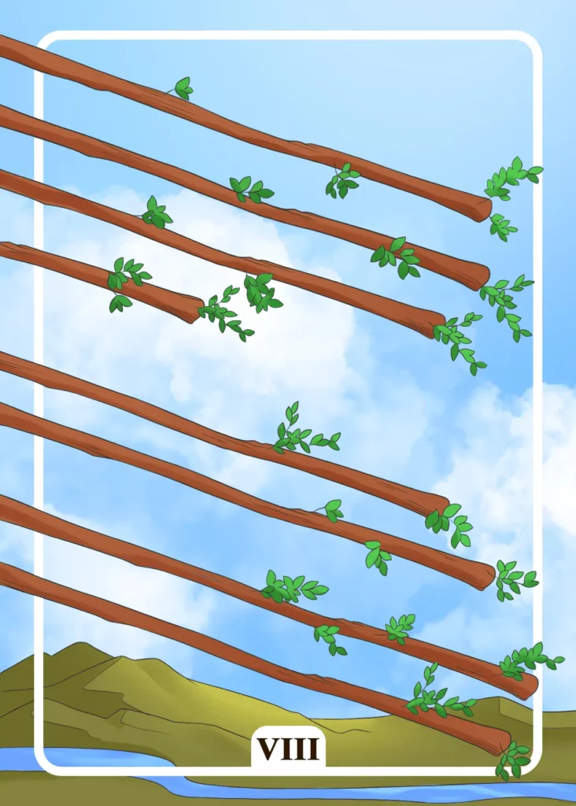

## Tarot Card Meaning
The Eight of Wands indicates that you now have the freedom to realign your life. In contrast to the previous Seven of Wands card, now most of the conflicts in your environment have subsided and you can finally orientate yourself towards new goals.

Perhaps you had to postpone some projects for a long time due to lack of time or too much stress. Now you finally have the opportunity to put such long-cherished projects into action and develop yourself.

A new direction requires a high degree of courage, strength and perseverance, especially at the beginning, to break out of your usual ways and take a new path. In the long run, such a new path will be worthwhile for your own development as well as for your everyday life.

Another aspect of the Eight of Wands is that unexpected opportunities will come your way, both in your professional and personal life. However, they will only be available for a limited time.

You must be ready to decide quickly for one of these opportunities. Otherwise, they will pass you by irretrievably.

Don’t take too long to decide if you should seize the opportunity and don’t overthink the pros and cons of it. Let your mind come to rest and rely more on your inner gut feeling.

Your subconscious mind recognizes long before our analytical intellect the promising potentials and associated risks, which are hidden in new opportunities and will be able to show you safely and quickly the right decision.

The Eight of Wands Tarot card also stands for profound changes that will soon come your way and to which you should adapt as soon as possible.

Our life often holds unexpected surprises, both positive and negative, to which we must adapt quickly to stay on the right track.

It will be easier for you to cope with life’s unexpected turns by having an open and unprejudiced view of the world.

Holding on to outdated beliefs and attitudes will make it difficult for you to cope with a constantly changing world. Give in to the flow of the world and don’t cling to unnecessary baggage so that you can enjoy the journey of life.

### Love: Single
As a single, the Eight of Wands reveals that you should proceed quickly and decisively in your dating and finally find a relationship. Often, your inner feeling will tell you within seconds whether a suitable partner is sitting in front of you on a date.

But only if you react quickly and courageously by revealing your feelings and concretely offering further meetings you will have a good chance that the flirtation will develop into a deeper relationship.

Because love often offers you very short opportunities to win a person for yourself, you have to act quickly and courageously.

In addition, the Eight of Wands stands for an upcoming change in your life, which will have a lasting effect on your love life. Such changes range from new job responsibilities to a move to another city.

In any case, you have the opportunity to meet new people and possibly discover True love. But you must be ready to adapt to the new life circumstances in the best possible way so that you have your head and your heart free for love.

### Love: Relationship
In a relationship, the Eight of Wands represents a realignment in your life together. You have just reached an important milestone in your life together, such as a wedding or the birth of a child and are now faced with the question of how to continue.

Consider together which goals you would like to achieve in the next five to ten years and agree on a few larger, common projects. Through new visions that you want to realize together, your cohesion and trust in your relationship will grow.

Furthermore, the Eight of Wands in a partnership shows that it is time to put your ideas and goals into action now. You have prepared long enough and should now dare to take the final step to make your dreams come true.

Start making concrete preparations to realize your common visions so that you can finally put them into practice.

If you wait too long, the current favorable circumstances could change quickly. Thus the realization of your goals is again in far distance.

### Health

For your health, the Eight of Wands means a fast regeneration after an illness. Your good physical constitution and immune system enable you to recover quickly.

But your own inner attitude also plays an important role in the recovery process. If you look ahead confidently and positively,
your healing will progress faster.

The Eight of Wands symbolizes a reorientation of your diet or physical fitness. Previous attempts to improve your health have been only moderately successful. Try different diets and sports until you find the right combination for your health goals.

### Career

Professionally, the Eight of Wands encourages you to become active and advance your career. Don’t wait for someone to offer you a raise or promotion, but take the initiative yourself. Ask for a meeting with your superior and convince him of the value of your work.

Another aspect of the Eight of Wands is that you long for a professional reorientation. You realize that your old job no longer satisfies you and have been toying with the idea of a career change for some time.

Follow your heart and make the necessary preparations so that the change to your new job goes well. Because working with passion for something has a positive effect on your own life satisfaction.

### Finances/Money

In financial matters, the Eight of Wands represents a favorable but temporary investment opportunity. Now is the time to act, as the corresponding offer will not be available for long.

Although, despite everything, you should weigh the risks and benefits well. However, hesitating too long can harm your financial situation in the long run.

In addition, the Eight of Wands shows that you should reorganize your finances. It is often worthwhile to compare old contracts with new offers that are significantly cheaper for the same service.

Likewise, you should not park your money only on the account, but look at which alternatives with small risk but acceptable net yield still exist.

In your reorientation, reinvest only a portion of your cash deposits and retain an emergency reserve.

### Destiny

As a destiny card, the Eight of Wands encourages you to act quickly to achieve your desired goal.

However, the opportunity is only available temporarily, so you should act quickly. Otherwise, you will have to wait even longer to fulfill your dream.

### Personality
The Eight of Wands shows a personality that is very willing to change. She can quickly adapt to new circumstances and also change her goals if necessary.

Moreover, this card reveals a character that is actionist in nature. Instead of sufficiently weighing the advantages or disadvantages of his actions, he simply takes action.

### Past
Your actionism in the last weeks is gradually taking its toll. You should calm down a bit and replenish your energy reserves.

You have weathered some changes in the recent past well and proven that you are very adaptable.

### Future
Soon, you have to act very fast. Otherwise, you miss good opportunities. By acting on time, you will have more success.

You long for a new direction in life. Soon you will have the opportunity to change your destiny.

### Yes or No
You have drawn your conclusions too hastily in this matter and should rather think about it again.

A no means a reorientation of your previous opinion, but in the long run, it brings you closer to your actual goal.