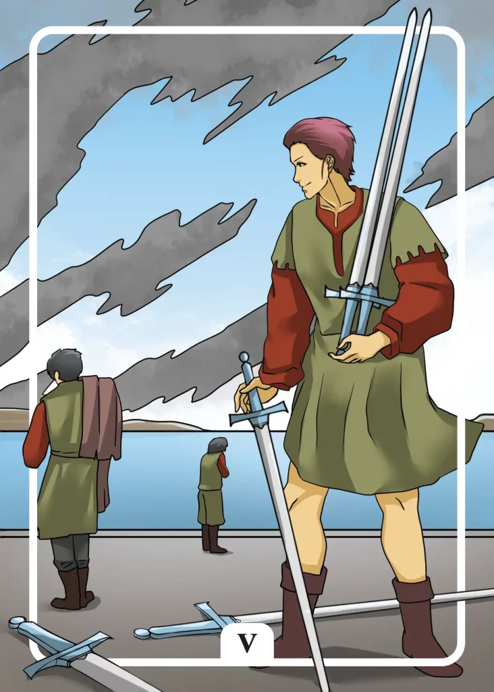

## Tarot Card Meaning
The Five of Swords reveals that you are in a great conflict with another person. You are investing a lot of time and energy to find out what your opponent plans to do next and how you can get ahead of him.

As a result, your conflict becomes bigger and bigger and gets into a spiral of psychological violence, at the end of which both of you will be losers.

Don’t let your quarrel rule your life, but focus on all the beautiful and happy areas in your life like family and friends. The conflict will become smaller by putting less energy and time into it and no longer permanently dominating your life.

Another characteristic of the Five of Swords is that you behave very selfishly towards your fellow human beings. You put your needs and opinions above those of your fellow human beings and try to implement them in your sense by all means.

Thus you get into many disputes with your environment. They put a lot of strain on your relationships with the people around you.

Instead of feeling personally attacked every time, there is a disagreement and making a conflict out of it, exercise restraint and reconsider your position in peace.

Choose the fights you want to fight wisely and don’t get involved in every skirmish, this way, you will save a lot of energy and spare the relationships with your fellow human beings.

The Five of Swords Tarot card represents a conflict in your life carried out with a lot of baseness and malice. A quarrel often starts small and becomes bigger and bigger the more different issues are involved and the argument is only on an emotional level.

When we only want to hurt our opponent and are no longer interested in solving the original problem, the danger arises that we use malicious means such as slander, lies or psychological violence.

By taking a step back from the dispute and realizing that you could have used the time you wasted to create beautiful moments in your life instead of seeking revenge, you will realize how insignificant and exhausting most conflicts are at their core.

### Love: Single
As a single, the Five of Swords Tarot card reveals that when you are looking for a partner, conflicts arise after a short time, so you are hardly able to get to know someone better.

The causes of these quarrels can be various. Often it is because we would like to “change” the partner at the beginning so that he fits better with us. Or we look for acquaintances who do not harmonize well with us from the character traits.

Try not to let your expectations of a first date become too high and reflect which characteristics in a partner promote harmonious coexistence and which ones lead to quarrels.

The Five of Swords also warns you to be careful when looking for a partner because some people have negative ulterior motives.

Especially if a date or an acquaintance is too good to be true, be alert. You should check the true intentions of your counterpart despite your feelings of love.

### Love: Relationship
In a relationship, the Five of Swords indicates that conflict overshadows your life together. Neither of you wants to give in and insists on his point of view. What started as a negligible matter has now turned into a big fight between you.

Often in this phase, old issues are brought up and reheated so no peace can come into the conflict.

Instead, try to realize that conflict is natural in a relationship and that through mutual respect and appreciation, all arguments can be brought to a positive conclusion.

The Five of Swords shows that one partner behaves very selfishly and inconsiderately so that the other part seems depressed and hopeless.

In a well-functioning partnership, both partners must take a step back in certain areas and make compromises so that each other’s boundaries are respected and you can live a happy relationship.

### Health

The Five of Swords stands for heavy burdens (separation, job loss), which harm your health. Symptoms like anxiety or depression can result from difficult life events.

Take some time out to get your life back under control. Also, give your body some rest by a massage or a soothing bath.

Furthermore, the Five of Swords stands for unresolved inner conflicts that manifest themselves as symptoms of illness.

Your body is thus a reflection of your soul and provides itself with an outlet through migraines, malaise or mood swings. Face your inner conflicts with the help of professional therapy and your body will recover.

### Career

In professional terms, the Five of Swords represents a conflict with colleagues or superiors. So far, you have had to put a lot of time and energy into this conflict.

But with what result? Without a discussion, your conflict will only escalate. If a conversation is not possible, you should reduce the contact with this person to a minimum.

Furthermore, the Five of Swords can signal that someone wants to harm you in your job. On the surface, this person may seem friendly, but as soon as you turn your back on him, he will try to harm you.

Be careful what you say to whom and choose your words carefully. In this case, talking is silver, silence is golden.

### Finances/Money

In financial matters, the Five of Swords reveals disagreement between you and another person. That usually concerns investments or expenses you cannot carry out alone, but only with the consent of a partner.

Listen to the objections of your counterpart openly and without judgment. A joint financial project always requires the consent of all parties involved. If someone has doubts, you should rather postpone your project.

Another meaning of the Five of Swords is that someone has betrayed you and owes you money.

As long as this person does not pay his debts to you, you should not give him any more monetary benefits. Think carefully about whom you lend money to and learn from your mistakes.

### Destiny 

For your destiny, the Five of Swords means that a serious conflict is burdening you. The dispute threatens to escalate more and more and harms your well-being.

Think about whether it is really worth it, to put so much time and energy into a quarrel with no solution for either party. Rather, direct your energy into building and maintaining relationships that are good for you.

### Personality
The Five of Swords stands for a selfish character type. The person cares only about his own interests and is not in the least interested in the people around him.

In addition, such a person is characterized by a pronounced potential for conflict. In order to get his way, he does not shy away from any confrontation, which he wants to decide for himself by any means.

### Past
In your past, there was often discord with another person. Think about whether you really want to invest further energy and strength in this dispute.

The past weeks and months have shown that someone in your environment thinks only of himself. You should reconsider your relationship with this person.

### Future
Soon someone may want to harm you. Therefore, get ready to defend your boundaries accordingly.

There is a tense conflict in the air, which will soon be unloaded. The sparks may fly, which is why you should take cover in time.

### Yes or No
There are other people involved in your question. Thus, there is a danger of a tangible conflict concerning your upcoming decision.

By saying no, you can best ensure that it remains peaceful without restricting your own needs too much.