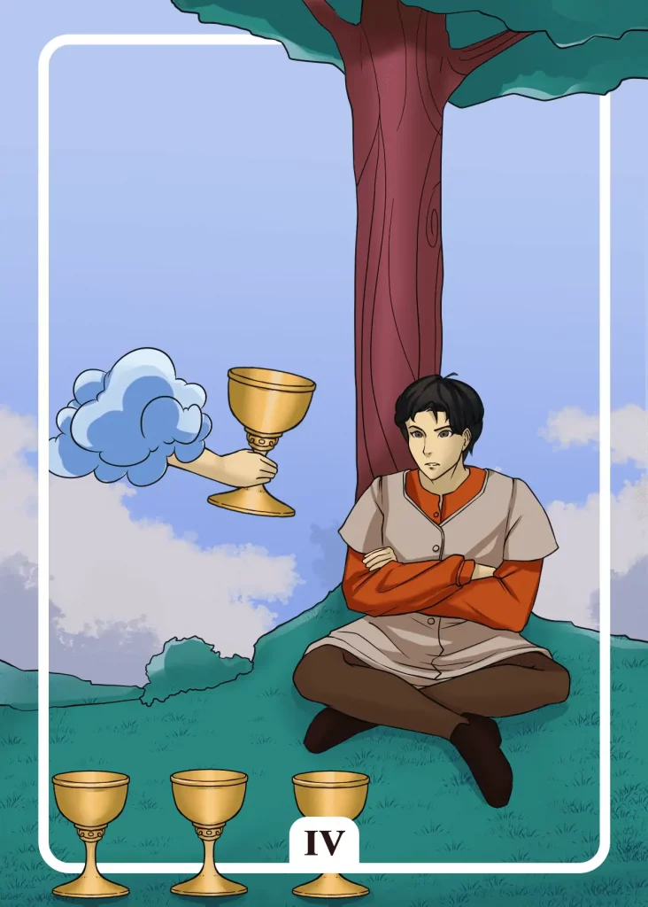

## Tarot Card Meaning
The Four of Cups reveals a phase of withdrawal and introspection. Through a temporary retreat from our everyday life, we try to find out new insights about ourselves and our further goals in life.

Self-view here means trusting our inner voice, which reveals how we can lead a fulfilled and happy life. However, this involves confronting the sides of ourselves that cause a lot of suffering and pain, such as greed, hatred and hostility.

Be careful if you are only concerned with yourself and lose contact with the outside world. Stay in contact with your environment, and you will be able to fathom your innermost self.

Another aspect of the Tarot card of the Four of Cups is the ignorance of opportunities that life offers us. Often in the course of our lives, we are given opportunities to realign our destiny and experience an improvement in our situation.

However, if we are too busy with ourselves and our problems, like the man in the picture, we will neither recognize the appropriate opportunities nor have the courage to seize them.

Ignorance of change in life can also come from consciously holding on to the current status quo because it gives us a perceived sense of security.

Dare to step out of your comfort zone, recognize and take advantage of the opportunities that can change your life for the better.

You will outgrow yourself and increasingly realize how many opportunities life offers you to become a happier and more content person.

The Four of Cups Tarot card reveals a great apathy that paralyzes us and thus delays our progress in life.

Opportunities to advance professionally or privately and develop yourself are pushed back according to the saying: “Better tomorrow but not today…”.

However, our life is in constant motion and every opportunity that reveals itself to us is only available for a certain period of time. If we miss the right time to seize it, the opportunity will disappear.

Live your life actively and do not wait for the perfect moment, but create it yourself by using the opportunities presented to you in the here and now and growing from them. Thus you plant the seed for still following chances, which will enrich your life.

### Love: Single
As a single, the Four of Cups Tarot card reveals to you that you don’t have your head clear enough to enter into a new relationship at the moment.

Perhaps you are still hanging on to a past partnership that is still taking up a lot of your attention and concentration.

Take the time to reflect on your past experiences from previous relationships.

Your gut feeling will tell you when it is time again to confide in a new person and dare a relationship with him.

Furthermore, the Four of Cups reminds you to reconsider your own behavior when looking for a partner.

You may be too hasty with your desire to enter into a firm commitment, even before mutual trust has been established between you and your potential partner.

Another reason why you have difficulties finding a new partner could be that you are too ignorant of your partner’s wishes and needs.

During the first meeting, try to listen actively and form a concrete, inner picture concerning the thoughts and feelings of your date.

### Love: Relationship
In a relationship, the Four of Cups card shows that one partner is too busy with themselves right now, causing coexistence to come to a standstill.

As soon as one part of the relationship withdraws completely and does not perceive or refuse the offered help of the partner, the partnership threatens to fail in the long run.

If you can’t get out of your head right now, at least try to talk to your partner about it so that he doesn’t relate your behavior to himself but can support you.

If your partner is the one who withdraws, ask your friends for help to establish communication with him again.

Another aspect of the Four of Cups is an increasing apathy in the partnership. This means that each of you is only busy with his own issues and you are hardly present as a couple or spend time together.

Try to become active together again by creating new opportunities to get closer again, such as through a hobby, fixed couple times, or a vacation together.

### Health 

For your health the Four of Cups means that you are circling around yourself a lot. Circling thoughts can quickly lead to a depressive mood or sleep disorders.

To secure your mental health, you should get support from friends or professional healers.

In addition, the Four of Cups encourages you to listen to yourself more to detect signs of illness at an early stage.

A good body feeling will let you know in time if something is wrong. Therefore it is important to take time once a day to observe your inner processes, for example, through meditation or yoga.

### Career 

For your profession, the Four of Cups means that you are too busy with yourself right now and what you are still missing in life. You overlook promising career opportunities that are opening up right in front of you.

Rather, focus on your resources and the world outside so that you can seize the next opportunity that comes your way.

Another possible interpretation of the Four of Cups is an increasing lack of drive at work. Such apathy is usually a result of great demotivation and disappointment.

To prevent this lack of drive from harming your private life, you should look for new professional perspectives that are more in line with your passions.

### Finances/Money 

The Four of Cups shows that you are currently very engrossed in your finances and neglect other important areas of life.

If you are preoccupied with money all day, you will miss many beautiful things that happen around you right now.

Rather take a fixed time during the day or week, where you deal intensively with your finances and have the rest of your free time for other things.

Furthermore, the Four of Cups warns you not to ignore financial problems. Debts do not simply disappear overnight but become more crushing with each passing day. Face your liabilities and work actively to pay off your debts.

### Destiny 

For your destiny, the Four of Cups means that you revolve too much around yourself. As a result, you miss the life around you and the opportunities it offers you.

Wake up from your apathy and drink from the offered Chalice of Life and create your everyday life again with vigor and creativity.

### Personality
The Four of Cups stands for someone who is very busy with himself. The person revolves a lot around himself and tries to figure out his own secrets and problems.

Likewise, this can mean an ignorant personality. He has very ingrained thought patterns and ignores, against better knowledge, influences from the outside, which could help him on his way.

### Past
In the past few days, you have been downright apathetic. You were indifferent to everything around you.

Pay attention and participate more in life again. Looking into the past can be a good starting point for introspection. Recognize your past mistakes and learn from them.

### Future
Upcoming challenges will occupy you in such a way that you can focus all your concentration only on these things.

Your future offers you many possibilities. But if you consciously ignore them, some doors will close forever.

### Yes or No
At the moment, you have enough to do with yourself. Therefore, it is difficult for you to look at your question from all the necessary angles.

You are far too absorbed in your own affairs and can hardly direct your focus on anything else, so your answer should be no.

