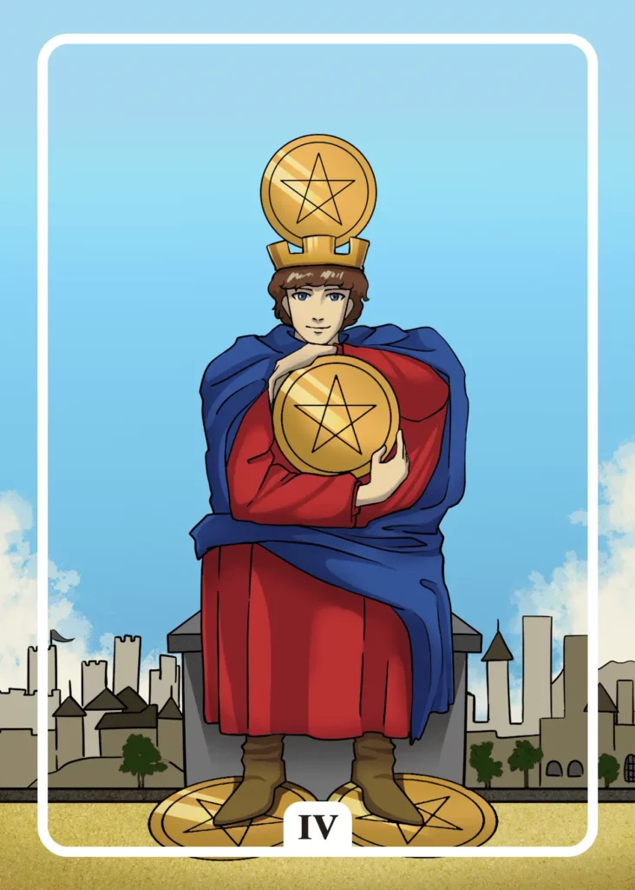

## Tarot Card Meaning
The Four of Pentacles admonishes you to critically examine your relationship to money and wealth. Money enables you to fulfill many material desires and is a guarantor for life satisfaction.

But wealth is always only a small part of your overall satisfaction and can not replace happiness that arises from relationships with other people.

Always take good care that the accumulation of material things is not your sole purpose in life because the more you own, the greater the fear of losing some of it.

Rather, concentrate on riches that are immaterial and cultivate relationships with other people and your hobbies accordingly.

Another aspect of the Four of Pentacles is that you try to control some areas of your life compulsively, which exposes you to constant inner tension.

Whether at work or in a relationship, you try to have the upper hand over every little detail and refuse outside interference.

However, it’s impossible to control everything all the time, because life’s coincidences can always throw our daily lives into turmoil.

By giving up some control and accepting that you can’t supervise everything all the time, you will be more relaxed. You won’t always have to be in a guarded position and thus can devote your energy to other positive or relaxing activities.

The Four of Pentacles Tarot card also reveals that you are very concerned about security. Your desire for safety makes you hardly able to move out of your comfort zone. You have a fixed daily routine and life plan, which gives you a lot of security and direction in your everyday life.

However, such a rigid life plan prevents that you move forward in life. Instead, you very spasmodically hold on to your inner attitudes.

As a result, you miss many spontaneous and promising opportunities in life that would help you on your life path in the long run.

Having a life plan gives you security, but be willing to leave your comfort zone now and then to try new paths and enrich your life.

### Love: Single
As a single, the Four of Pentacles reveals that you are too oriented towards material values instead of inner ones when choosing a partner.

High social status and a corresponding financial endowment are important factors for you when choosing a partner.

However, money alone does not make you happy, as we all know. Focus more on the inner values that decide how harmonious and fulfilling a partnership is in the long run.

Therefore, when choosing your partner, focus more on his true character. Inner values like loyalty, reliability, and empathy can not be bought with money.

Another aspect of the Four of Pentacles is that you use very limited strategies to find a partner. While some of your strategies have worked in the past, others prevent you from finding a fulfilling relationship.

Venture out of your comfort zone and try new small talk topics, dating locations, or new styling, and then see how these changes affect your dating positively or negatively.

Finding the right partner is a very dynamic process and the more seduction strategies you have in your repertoire the better you can react to unexpected situations.

### Love: Relationship
In a partnership, the Four of Pentacles reveals that one partner tries to control everything in the relationship, creating a great tension in living together.

Such a compulsion to control often results from great fear of losing one’s partner. Instead of binding the partner more firmly to oneself, it causes exactly the opposite, namely that the partner moves away.

By allowing each other your private space in the partnership, you show the other partner that you have confidence in him and each of you can develop happily in his own way.

Furthermore, the Four of Pentacles symbolizes that you long for more security in your relationship.

Especially if you currently face many challenges regarding your jobs or further family planning, you will quickly get a feeling of insecurity regarding your joint future.

Discuss the challenges ahead of you regularly and think together about how best to tackle them. By making concrete plans and agreements, you will surely be able to manage your everyday life.

### Health

For your health, the Four of Pentacles means, that you tend to control everything. A mania for control can lead you to be concerned only with counting calories or setting fixed times for your fitness program.

Your health is a dynamic process where not everything has to be perfect. Find a healthy balance between control and enjoyment of life.

Another aspect of the Four of Pentacles is that you have a great fear of disease. You feel safest in your own four walls. But your high need for security can lead to isolation.

Illnesses are part of our everyday life and can help our immune system to become more robust. Therefore, do not restrict yourself too much and go out to enjoy life.

### Career

In a career context, the Four of Pentacles represents a strong focus on purely material aspects. While money can be an important motivator in choosing a career, it is usually short-lived.

Much more important for one’s own satisfaction are the working atmosphere and the appreciation of one’s own performance. Therefore, do not base your choice of job on purely financial aspects.

In a Tarot reading, the Four of Pentacles means that you are in a professional dead end. On the one hand, you long for new challenges in your job.

On the other hand, you don’t want to leave your comfort zone, because at least you know what to expect in your current job. Use your intuition in your decision-making and follow the direction it points you.

### Finances/Money

In financial matters, the Four of Pentacles indicates that you want to have as much control over your money as possible. Therefore, you keep your money very tight and turn over every penny twice before you spend it.

While this approach gives you a high level of financial security, you also take away a lot of pleasure if you never indulge yourself. Set aside a small amount that you can use to treat yourself at the end of the month.

Furthermore, the Four of Pentacles reveals that you are very focused on material things. There is a danger that you neglect important areas of life such as friends and family. The latter are not for sale and have a much higher value in the long run than all the money in the world.

### Destiny

For your destiny, the Four of Cups reveals that you are very attached to old values. In order not to give them up, you cling to them spasmodically.

If you learn to let go, you will be able to move forward again. You don’t have to leave all your values behind, but only the ones that increasingly turn out to be ballast.

### Personality
The Four of Pentacles as a personality card stands for someone who always needs control in life. Without it, he lives in constant fear he might lose something important or be in danger.

Furthermore, it describes a character who is materialistically minded. He finds his happiness mainly in accumulating wealth and less in social relationships.

### Past
Not long ago, you felt you had to control everything. However, the associated stress has also taken a toll on you.

In the past, you let yourself be blinded by material values and neglected relationships with other people.

### Future
You want more certainty in future decisions. But you can only control the aspects being in your sphere of influence.

Too rigid thinking patterns will hinder you in upcoming challenges. You will receive new impulses if you look beyond your own horizon.

### Yes or No
You want to be in control of your question. But you have the highest chance of security only with a no answer.

It allows you to have a clear overview of the consequences of your actions and therefore, not experience any unpleasant surprises.

