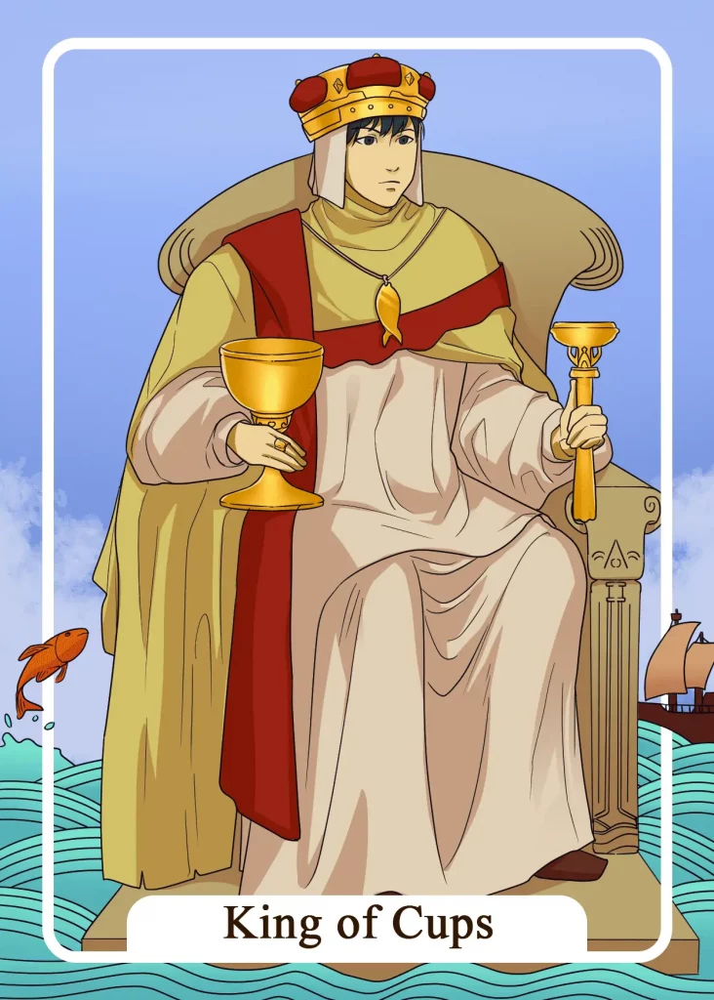

## Tarot Card Meaning
The Tarot card of the King of Cups reveals that you live in harmony with your feelings and mind and thus radiate a deep calmness to your environment.

Even in very difficult or upsetting situations, you control your emotions and can thus make rational decisions both for yourself and those around you.

You are not so focused on your emotions because you have already dealt with them intensively and know when it is necessary to express your feelings.

Because of your calmness and composure, you are like a rock for your social environment, which defies even the strongest storms and helps other people to get through the storm unscathed.

The King of Cups also stands for a huge amount of wisdom that you have acquired in the course of your life and share with the people around you.

Wisdom does not only mean that you have good intellectual skills but also includes emotional competencies as well as creativity when it comes to solving problems.

Only when you are in good contact with your inner self, you can draw from the inexhaustible source of your subconscious, which gives you wisdom beyond books.

By continuing to trust your intuition, you will be able to face any problems and challenges in life with serenity and creative solutions.

Another characteristic of the King of Cups is his extensive tolerance and diplomatic skills. By leading a tolerant lifestyle and being free from prejudice, you can learn a lot from your fellow human beings, no matter what color their skin is or what culture they come from.

You will learn a lot about other cultures and peoples and yourself, through such broad knowledge.

Tolerance enables you to form valuable and deep relationships with many different people and enables you to mediate conflicts between your fellow human beings.

Your diplomatic skills make you a sought-after contact in disputes, and you thereby create a high degree of harmony in your environment.

### Love: Single
In the love tarot reading, the King of Cups stands for a tolerant attitude towards your choice of partner.

Don’t narrow the circle of people you would enter into a relationship with unnecessarily by fixed dogmas, but instead open yourself to different characters and get a feeling for who suits you best.

By being tolerant of the characteristics of those around you, you will discover many new qualities that are endearing and enrich your love life.

The more tolerant you are to your counterpart, the more he will open up to you, which already lays the foundation of a deep basis of trust.

Another aspect of the King of Cups for you as a single is that your past relationship experiences contain a lot of useful knowledge for your next partnership.

Through the relationships you have already had with other people, you already know the ups and downs that every couple has to face. You can calmly reflect on why some relationships failed and what positive lessons you took away from them.

Use this wisdom for yourself to make your upcoming relationship long-lasting and fulfilling.

### Love: Relationship
In a relationship, the King of Cups encourages you to lead conflicts solution-oriented instead of too emotional. Be a role model to your partner. Act diplomatic and work with him to find a solution to your dispute.

Emerging feelings of anger or fear in an argument are okay as long as they do not take control of you, so you can objectively discuss your dispute with your partner.

Your diplomatic attitude will transfer to your partner so that an initially highly emotional dispute will increasingly calm down.

Another important message of the King of Cups in a partnership is that you show tolerance towards the other partner. We all have rough edges, which we sometimes rub against or bump into.

Instead of wanting to change the partner at any cost, we should practice tolerance and learn to love and appreciate the small imperfections because they are, in a sense, the spice of a relationship.

True love develops when both partners appreciate each other and love and accept the other as he is.

### Health 

For your health, the King of Cups means allowing yourself more rest periods in everyday life.

That will allow your body to recharge its batteries and mobilize your defenses. Use the breaks to relax and thereby reduce stress. Afterward, you can start the day with new energy and vigor.

Furthermore, the King of Cups stands for returning to old healing methods that our grandparents already knew.

Profit from the wisdom of past generations by trying old remedies like calf compresses or herbal compresses. These often have few side effects and gently activate your self-healing powers.

### Career 

For your job, the King of Cups means that you should always act diplomatically in conflicts between colleagues. You create a positive working atmosphere through your skill to solve disputes in a fair and solution-oriented way.

Your co-workers appreciate your advice, so you play a supporting role in the overall satisfaction of your department.

In addition, the King of Cups stands for a high degree of tolerance towards different work styles and personalities at your work. Different people and characters can contribute to the diversity of ideas and problem solving on the job.

However, this is only possible if there is an atmosphere of mutual respect and appreciation towards all colleagues.

### Finances/Money 

In financial matters, the King of Cups encourages you to seek advice from experienced advisors. That can be special financial advisors or good friends/relatives who know through years of experience exactly how to invest your money.

Good advice usually costs a little more but will save you a lot of money in the long run, which you would have to pay for expensive mistakes without an advisor.

Another meaning of the King of Cups is to stay calm when your finances do not develop according to plan.

Especially if interest rates or shares do not rise, you should not panic, but calmly evaluate the current situation. Often patience in financial matters pays off much more than hasty actions, so always keep your long-term goal in mind.

### Destiny 

For your destiny, the King of Cups means that you should continue to practice tolerance towards your fellow human beings.

Thus you will be able to take a non-partisan position in conflicts and bring together different points of view. Your social environment will appreciate you as a far-sighted mediator and show gratitude towards you.

### Personality
The King of Cups stands for a character that rests firmly in itself. Nothing can upset him, so he is able to keep the overview even in difficult situations.

Furthermore, the card indicates a person who always tries to settle conflicts diplomatically. In doing so, he tries to consider the points of view of all parties involved.

### Past
In the past, you have often managed to solve conflicts diplomatically. Think back to how you were able to appease the disputants.

Lately, you have practiced tolerance towards your fellow human beings. That will open new ways for you.

### Future
You will face a difficult challenge in the future. Use your intuitive wisdom to find an appropriate solution.

Things may get quite turbulent shortly. Keep your inner calm to be prepared for the coming storms of life.

### Yes or No
Trust your inner wisdom when making your decision. It will surely show you which way to go without taking unnecessary risks.

At the moment, you are definitely on the safe side with a yes answer. You can go about your daily life again with a peace of mind.

