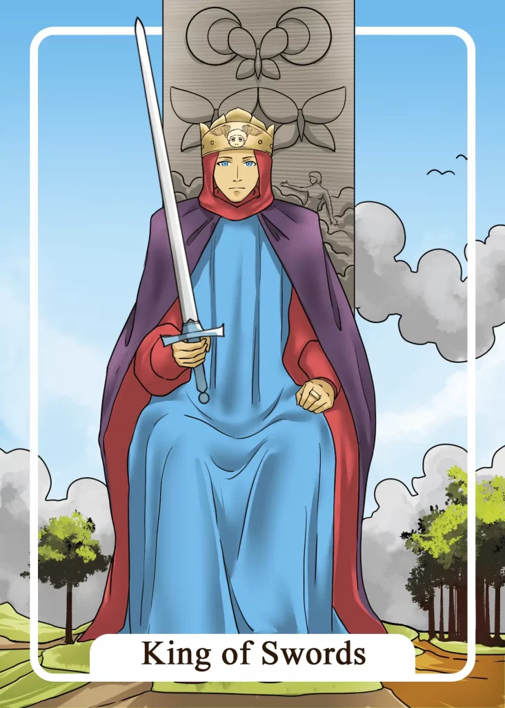

## Tarot Card Meaning
The King of Swords card stands for approaching challenging problems you are currently facing analytically and strategically. Think of problems as challenges that will help you sharpen your mind and strengthen your problem-solving skills.

Use all facets of your mind to develop different solutions and make a detailed plan of how you will implement your solution.

Always include your intuition in your planning, as it will quickly give you a sense of the direction you need to take if you run into an obstacle.

By further training your analytical skills through overcoming challenges, you will be able to overcome any life crisis, no matter how big, with inner calm and rationality.

Another meaning of the King of Swords is that you should always be guided by moral and ethical aspects in your judgments and decisions.

Whether at work or in the family, every decision you make will have a short- or long-term impact on your fellow human beings and your relationship with them.

If your judgments weigh the individual and common welfare against each other, you will not be guilty of anything and always have a clear conscience towards your decisions. Take the dignity of man as an evaluation basis for your evaluations.

By exemplifying high morals and acting accordingly, your environment will hold you in high esteem and regard your judgments with respect and appreciation.

The King of Swords in a Tarot session means that now is the right time to use your leadership skills to guide your fellow man through a difficult time.

Perhaps there is a crisis at work due to a lack of orders and great insecurity or in the family where all members seem to be disoriented due to a heavy loss.

Leadership qualities do not require any titles but rather include giving your environment support and security in times of chaos and uncertainty.

By being clear-headed and determined to find a way out of the crisis, you will be a rock for the people around you.

Your inner calmness and steadfastness will transfer to your environment. Together you will safely survive the turbulent times under your guidance.

### Love: Single
As a single, the King of Swords reveals to you that you will quickly find a new partner through your natural gift of responsibility and leadership. After all, it is important to have a partner who can provide support and security in difficult times.

Your great sense of responsibility gives you a natural aura of calm and strength that quickly captivates other people.

However, when looking for a partner, make sure that your potential partner can also give you comfort and support in difficult times so that you complement each other.

Another characteristic of the King of Swords in a love tarot context is to choose your partner carefully and analytically. First, become aware of what character traits you expect from a partnership before you rush into the next relationship.

Because often we get to know our counterpart only after the first infatuation so correctly and by an exact pre-analysis on your part, you can decide relatively fast and surely for you whether from a love affair something more serious becomes or not.

### Love: Relationship
In a partnership, the King of Swords represents a high ethical and moral way of life that you live as a couple in everyday life. You put your own needs in the background in favor of your partnership. Both partners work to keep your relationship happy and fulfilling.

Through your open and appreciative communication, you are able to resolve even difficult conflicts without hurting or humiliating your partner.

Each of you has a clear conscience towards the other so that nothing stands between you, enabling you to feel true love for each other.

In the love tarot, the King of Swords also shows that justice is a high good in your relationship. You are very concerned that the tasks in your relationship are fairly distributed so that you can handle the burdens of everyday life together well and thus still have enough strength to spend time as a couple.

Fairness in a partnership also includes both of you being able to apologize and make amends for your misbehavior after arguments.

### Health

The King of Swords advises you to see a specialist if you have persistent symptoms. Your family doctor can only help you with general illnesses.

You should not risk worsening your symptoms and ask for a referral in time. The sooner you have clarity about your symptoms,
the higher the chances of cure.

Another meaning of the King of Swords is making a concrete plan to achieve your goals.

That includes a fixed daily structure with times for getting up, eating and exercising, which you can follow. This way, you will quickly develop healthy habits that will significantly increase your well-being.

### Career

In professional terms, the King of Swords encourages you to live out of your leadership potential. Convince your colleagues of your goals with words and deeds.

They will support you more willingly than if you try to exercise power through the mere hierarchy. Leadership also means taking responsibility in case of failure and protecting your employees.

Another meaning of the King of Swords is that you should be a role model for ethical behavior on the job.

That includes appreciative communication and support towards your colleagues. In this way, you contribute to a relaxed and trusting working atmosphere and are a role model for younger colleagues in particular.

### Finances/Money

For your finances, the King of Swords encourages you to use your mind before investing a large sum. Carefully weigh the advantages and disadvantages of your financial plans.

Don’t let time pressure you in your deliberations. Instead, gather as much information as possible to have a solid basis for your decision.

Another aspect of the King of Swords is to spend your money responsibly. Everything we buy has a direct impact on other people’s lives.

Therefore, invest your money in sustainable products produced under humane working conditions. In this way, you make an important contribution to the common good of many people with your daily purchases.

### Destiny

As a card of destiny, the King of Swords stands for a leadership role that is given to you. However, with the associated power also comes great responsibility.

Therefore, use your position of power wisely and try to act in the best interests of everyone involved. In this way, you will become a person who is appreciated and respected by others because of your responsible and moral behavior.

### Personality
The King of Swords reveals the leadership qualities of a person. This person can inspire people with their goals and motivate them to give their all.

Furthermore, it means a character that has a high sense of justice. The person wants conflicts to be fair and on an equal footing and interferes if necessary to create a balance.

### Past
Take the time to analyze your successes and defeats from your past. You will gain some valuable insights.

To develop yourself ethically, you should think back to actions in which you helped others selflessly.

### Future
Soon you will encounter a situation in which you should do justice. Don’t get distracted by unnecessary details, but focus on the essentials.

Soon, your leadership skills will be in demand. Don’t worry. You will be a good role model for your fellow men and guide them safely.

### Yes or No
You have already carefully weighed the pros and cons of your question. Therefore, you know that a yes answer is the best alternative in this matter.

Use your sharp mind to also assess the long-term consequences of your choice.