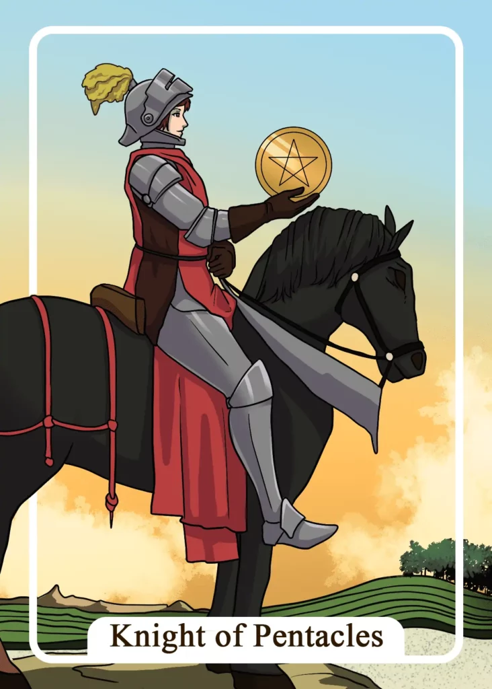

## Tarot Card Meaning
The Knight of Pentacles reveals to you that with diligence and patience you will achieve your goals in life. For this, it is important to know exactly where you want to go and to formulate concrete goals accordingly.

Give your big plans in life a correspondingly high priority and be prepared to need a lot of strength and perseverance for their implementation.

Don’t get carried away with wanting to realize your goals as quickly as possible at the expense of quality, but rather plan enough time so that you can implement your plans carefully and the results correspond to your ideas.

If you are persistent and diligent in pursuing your goals, you will be able to overcome any obstacle on your way and continue on your path.

Another characteristic of the Knight of Pentacles is that you pay more caution in your present undertakings.

You have many plans and thoughts right now about how you want to change some areas of your life to your liking but beware of acting too hastily, as this can quickly lead you to a dead end.

Always consider the consequences of your thoughts and actions and weigh accordingly your further proceeding well, before you act hastily.

Also, be careful to share your plans with certain people who may put obstacles in your way out of envy or resentment.

By calmly and prudently planning and weighing your next steps, you can bring about your desired changes, while always keeping a watchful eye on yourself and your surroundings.

In a Tarot reading, the Knight of Pentacles shows you how important it is to act in a planned manner while staying grounded.

Big dreams will only come true if you make good preparations for their realization in advance. In addition, you must formulate your wishes into realistic goals. Otherwise, you run the risk of losing yourself in daydreams and castles in the air.

Divide your plan into small subgoals that are easily achievable so that during your long journey your motivation is maintained by small successes.

The better prepared you are from the beginning and the more you have planned your project, the easier it will be for you to realize your dreams, no matter how big or small they are.

### Love: Single
As a single, the Knight of Pentacles urges you to be careful about your partner’s well-being. Sometimes we meet people we fall in love with instantly, making it almost too good to be true.

With such a quick infatuation, however, caution is advised. Ask yourself whether the feelings of your counterpart are genuine or whether other ulterior motives are at play.

Therefore, do not give away your trust too lightly. Take the time to explore your partner and their intentions in peace and check for their authenticity.

The Knight of Pentacles encourages you to be diligent and persistent in your search for a partner. You should work hard on yourself and do your best both physically and mentally to increase your chances of meeting a new love.

For example, by exercising regularly and increasing your physical fitness, your appearance will change for the better in the long run.

The same is true if you regularly practice small talk and get to know new people. The more diligent you are and the more you improve your skills in love, the more likely you are to attract a new partner.

### Love: Relationship
In a relationship, the Knight of Pentacles encourages you to look realistically at your partnership. It is of little use to talk down or even deny problems in living together because this will keep them bubbling and eventually boil up.

Instead, dare to see your partner and your relationship as they are and set realistic expectations for them.

Face the reality of your life together and you will be able to eliminate open conflicts and problems in your partnership.

The Knight of Pentacles also represents a forward-looking and planned approach to your relationship. You both have fixed goals as a couple. Together you make the necessary preparations to make your dreams come true.

You work closely together and agree in advance on the upcoming tasks and further steps. In addition, you are very forward-thinking about upcoming challenges and crises that life has in store for you, so you will overcome these obstacles without worry.

### Health

For your health, the Knight of Pentacles means that you are on the mend after an illness. However, you should not rush things and give your body some rest.

Be careful with your energy reserves and make sure to regain your strength little by little through a regular daily routine.

Furthermore, the Knight of Pentacles stands for a regular daily routine to support your health. Such routine includes fixed rituals for nutrition and exercise, which help you to lead a balanced lifestyle.

Be sure to adjust your routines according to your individual progress and goals. It can also mean taking a step back.

### Career

Professionally, the Knight of Pentacles encourages you to develop realistic expectations. Especially at the beginning of a new job, you can’t expect big jumps in salary yet.

Take your cue from your colleagues to develop attainable and realistic goals, such as a raise or promotion.

Another characteristic of the Knight of Pentacles is that you can achieve your professional goals through hard work and forward planning. But first, you need to have a concrete idea of where you want to go.

Then you can develop a strategy for your career. Plan in years because you will have to invest a lot of time and effort to be successful in your career.

### Finances/Money

For your finances, the Knight of Pentacles means that you should plan any major investment in advance. Consider carefully whether you can manage your project on your own or whether you need a loan.

Then you can plan in advance how much money you still have to save and when you will have the required sum together.

The Knight of Pentacles shows that your diligence is slowly paying off in the form of higher cash income. Long-term investments are finally yielding profits or you are getting a substantial raise in your job.

Don’t rest on your initial successes, but continue to be diligent. Then in five or ten years you will achieve even greater prosperity.

### Destiny 

As a card of destiny, the Knight of Pentacles reveals that you will achieve your goals in life through diligence and planned action.

If you approach the challenges of your dreams ahead of you with a cool head and don’t blindly rush into them, you are sure to succeed.

Realizing a life’s dream usually does not happen overnight but requires patience and hard work.

### Personality
The Knight of Pentacles reveals a realistic thinking personality. It does not paint the world pretty but sees things as they are and acts accordingly.

Furthermore, the card represents someone who acts very cautiously in many ways. The person shies away from any risks and wants a high degree of security for his actions.

### Past
Look back on your past with a realistic view. That will make you realize how much you have already accomplished through your own efforts.

Be careful what you wish back from past days. Sometimes we paint such past things much too rosy.

### Future
Soon, a high degree of diligence will be required from you to realize your plans. Make sure to leave enough room for regeneration.

Make a good plan for your near future to be able to master the tasks connected with it in a sovereign and structured way.

### Yes or No
Be careful with your upcoming decision. Actually, you already know that there can only be a no-answer in this case.

But the other alternative seems just as tempting but has some pitfalls for you. Therefore, remain realistic in your assessment.

