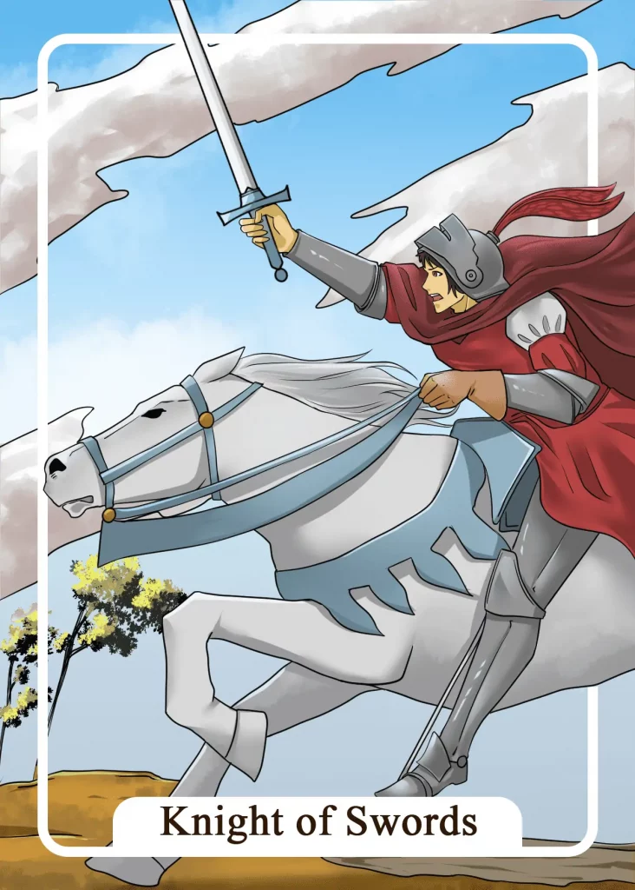

## Tarot Card Meaning
In a tarot reading, the Knight of Swords reveals that now is the right time for you to realize important life goals.

Your ambition to achieve and realize your goals gives you tremendous strength. With their help, you can easily overcome even the most challenging obstacles.

Even if you get a strong headwind with one of your plans, you stay on your path to achieve your goal. On the contrary, you are even more motivated and ambitious to realize your plans.

As you progress, you develop more and more energy and strength which help you to accomplish your mission.

The Knight of Swords Tarot card encourages you to achieve your goals with intelligence and planning. Good preparation is essential to be prepared for and overcome upcoming adversities.

The knight is well protected against oncoming enemies and has wisely chosen his armor and best horse for his journey. By following the knight’s example and carefully planning and preparing your actions in advance, nothing will throw you out of the saddle so quickly.

Always include the component of chance in your considerations and always have a backup plan ready to protect you from unpleasant surprises in case of emergency.

Another meaning of the Knight of Swords is that you must use your authority to implement your plans. In positive terms, authority is about holding the reins firmly in your own hands and not letting other people take them away from you.

By giving clear direction to your plans and speaking to your fellow men with the help of your rationality and ambition, they will follow your authority and support you on your mission.

Authority is always connected with responsibility. Even if your mission fails, you should take full responsibility and protect the people who have supported you.

### Love: Single
In a love tarot reading, the Knight of Swords reveals that you should be very ambitious in your partner search so that you can find your dream partner. Don’t let a few rejections throw you out of the saddle, but persistently pursue your goal to find your partner for life.

It is often necessary to jump over your own shadow and take the initiative, for example, by directly revealing your feelings of love to the appropriate person.

If you continue to look for the love of your life and are willing to invest time and energy, your efforts will bear fruit.

The Knight of Swords symbolizes that you should proceed strategically in your search for a partner. Use your intellect to eliminate disturbing elements from the beginning of a date.

By reacting to unexpected events during a date, spontaneously but still with intellect and strategy, you will be able to deeply impress your partner with your abilities and radiate a sense of security and sovereignty.

### Love: Relationship
In a partnership, the Knight of Swords shows that you enjoy a firm authority in some areas of your relationship that your partner can lean on.

Having self-assurance and self-confidence helps you to be steadfast in stormy times and to be able to give your partner support as well.

Having authority in a relationship does not mean that the other partner is oppressed. However, in certain areas, like finance, job or raising children, one of you takes the main responsibility to relieve the other and thus contribute to a balanced partnership.

The Knight of Swords Tarot card also symbolizes that you are very success-oriented as a couple and like to realize your plans together.

Common goals or projects are a wonderful opportunity to strengthen your relationship as a couple and develop your skills.

The more goals you achieve, the more difficult challenges you can face together and will turn them into another success.

### Health

The Knight of Swords Tarot card shows good news for your health. In case of an illness, you will soon see treatment successes.

Your body will slowly regain its former strength so that you can master your everyday life with confidence again. Physiological values such as blood pressure or blood sugar can also recover.

Furthermore, the Knight of Swords stands for ambitiously pursuing your own health goals. By regularly doing something for your health, you will sustainably strengthen your defenses.

It is often the small changes in everyday life, such as taking the stairs instead of the elevator, that have a big effect. The more
small successes you have regarding your health behavior, the stronger your well-being and immune system will be.

### Career

Professionally, the Knight of Swords stands for ambition. You have concrete goals for your career and do everything to achieve them.

In the past, you showed that you can put your plans into practice. Through your ambition, many doors are open to you for your career, between which you can choose freely.

Furthermore, the Knight of Swords shows that you should express your authority in your profession. That includes representing your opinion even in the face of opposition from colleagues and superiors.

Learn to convince by arguments instead of threats. In this way, you will radiate a natural authority and better implement your plans in the company.

### Finances/Money 

In the financial field, the Knight of Swords stands for well-thought-out investments. Do not blindly follow every money advice, but think for yourself.

By reading a lot and talking to other people about finances, you will gain valuable knowledge on how to invest your money. Follow your own thoughts because they are your best advisor.

Furthermore, the Knight of Swords symbolizes that a lot of ambition is needed to achieve your financial goals. That includes the ability to put aside material desires in favor of your plans.

But if you always have your financial goal clearly in mind, you will survive even minor setbacks well and soon achieve prosperity.

### Destiny

As a destiny card, the Knight of Swords stands for a dynamic departure. The time is ripe to realize your dreams with verve and ambition.

You won’t let anything stop you from your plans and you will approach your goals unstoppably. As long as you stay on course, you will be sure of success.

### Personality
The Knight of Swords represents a success-oriented personality. He wants to finish everything he starts. Therefore, he sets new and higher goals.

Furthermore, an extremely ambitious character is described by this card. Even if the situation seems hopeless, he does not let himself be dissuaded from his plan and puts in the extra effort.

### Past
Already in the past, you have been very focused on the fact that your plans must always succeed. However, this has also created enormous pressure on you.

Recently you have acquired a high degree of authority in some areas of life. That makes it easier for you to realize your plans.

### Future
Your inner ambition can help you to face even bigger challenges in the future. Rely on your inner strength and endurance.

You should use your mind well in the near future so you know how to use the opportunities lieing ahead of you.

### Yes or No
In this matter, you have been searching for the right answer for a long time. But with your ambition, you should definitely decide for a yes.

That is the best way to bring out the dormant potential in you. Just be careful not to become too impetuous.

