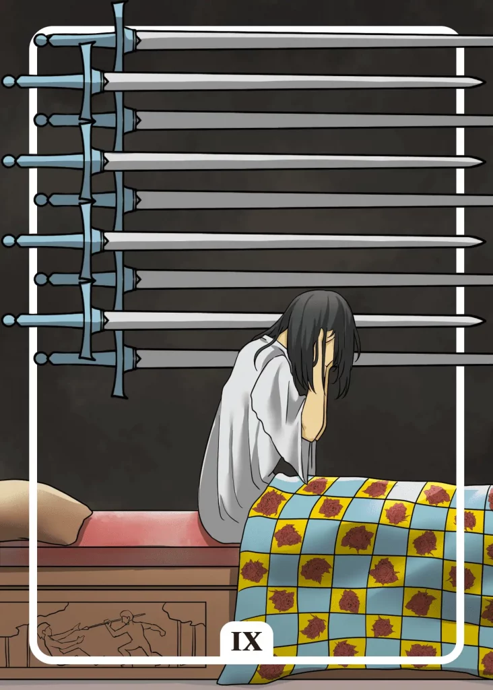

## Tarot Card Meaning
The Nine of Swords Tarot card reveals that your everyday life is determined by great fears and worries. These can be fears of the future or past events that catch up with you again. Your thoughts only revolve around escaping from these worries. Therefore, you would like to withdraw from the world.

But the more we surrender to our fears, the more they will influence our thoughts and actions. Be brave and face your fears and question what should happen to you in the worst case at all.

Most fears are only strongly threatening in our imagination and in reality, have a little negative impact on our daily lives.

By calmly contemplating and reflecting on your thoughts, you will realize that your fears will vanish as quickly as a nightmare upon awakening.

The Nine of Swords represents deep fears that can become self-fulfilling prophecies in your mind. If you keep telling yourself: “I don’t dare, I can’t do it.” your mind will eventually take these phrases for real and prevent you from daring to do new things.

Self-fulfilling prophecies often have little to do with your true abilities but are only a product of your fears. They remind you to be mindful of your thoughts, as they influence your actions.

Fortunately, you can also program yourself in the other direction by rephrasing your negative sentences into courageous and self-confident phrases, like “I can do it, I am courageous.”.

Another characteristic of the Nine of Swords is that a great feeling of guilt leaves you no peace and plagues you. The more you run away from your responsibilities, the more lasts the emotional burden on you.

Every human being is burdened with guilt and makes mistakes in his life. It is important to recognize when we have behaved wrongly and apologize and make amends accordingly.

On the one hand, this gives us a clear conscience and we can sleep peacefully and live our daily lives. On the other hand, we practice humility and care for our fellow human beings when we admit our mistakes and take responsibility for them.

### Love: Single
In a love tarot reading, the Nine of Swords reveals to you as a single that great fears regarding finding a partner plague you. Your fear of rejection is omnipresent and prevents you from getting closer to other people.

Be aware that rejection can happen to anyone and is part of life. The more you try to connect with other people and honestly reflect your behavior, the more positive relationships will arise for you, some of which can lead to a deeper partnership.

The Nine of Swords also shows that past events torment you and impede your search for a new partner.

First of all, confront your torments of the soul that bother you and try to dissolve them in such a way that you have a clear head again and your feelings are free of fear and worry.

Only when you have a pure and open heart inside you, free of fear and anguish, will you be able to engage in a new love again.

### Love: Relationship
In a partnership, the Nine of Swords symbolizes serious worries about the future of your relationship. You are possibly in a deep relationship crisis, from which no way out seems apparent so both partners are stuck in their worries.

To save your partnership, it is essential that you get together again and at least talk about your fears with each other. Only together you can find a way out of your crisis and develop the courage to walk this path together.

The Nine of Swords also shows that a deep feeling of guilt towards your partner plagues you. You have said or done something in the past that caused you to feel heavy guilt without apologizing to your partner or even disclosing what happened.

Honesty and trust are the two most important pillars in a relationship. Only if you confide in your partner and reveal your guilt, you will be able to free yourself from your burden.
Your relationship then has the chance to regain its stable foundation, characterized by mutual trust.

### Health

In health matters, the Nine of Swords stands for severe mental stress. The spectrum ranges from depression to anxiety, limiting your everyday life.

Get professional support to help you reduce your stress significantly. However, you should be prepared for a longer treatment to regain your mental health in the long term.

Another meaning of the Nine of Swords is that you are very concerned about your health. Your fear of serious diseases makes you go to the doctor at the slightest symptoms.

Such hypochondria makes your everyday
life very difficult because everything revolves around diseases. Rather focus on positive health aspects that you can actively shape, such as sports or nutrition.

### Career

Professionally, the Nine of Swords reveals that you suffer greatly from a bad working atmosphere at work. Bullying by colleagues can cause strong anxiety, making you afraid to go to work.

You can only change your situation by finding allies at work. Otherwise, changing jobs may be the best option.

Furthermore, the Nine of Swords shows that you are very worried about your professional future. You may be facing a performance review or a wave of layoffs at your company.

Do not let your fear rule your life. The worst thing that can happen to you is a dismissal, but after that, you can apply for new jobs, which may bring you more advantages than you imagine.

### Finances/Money

Financially, the Nine of Swords represents great fears for the future that plague you. You are worried about whether you will be able to pay your bills in the future because of high financial burdens.

Think about which things you really need to live and where you can perhaps save something. Often this means reducing your lifestyle, at least for a while.

Another aspect of the Nine of Swords is that you have high debts that cause you sleepless nights. However, fear and self-doubt will not help you solve the cause of your problem.

You should rather actively contact a friend or a professional debt counselor so that you can enjoy your financial freedom again in the foreseeable future.

### Destiny

As a destiny card, the Nine of Swords reveals that heavy fear plagues you. To get rid of it, you must first allow and accept your anxiety.

Depending on what the trigger for your fears is, you should best approach and resolve it with an experienced companion (therapist or friend).

### Personality
The Nine of Swords describes an anxious personality. She worries about not being able to cope with many challenges in life and imagines the worst scenarios.

Furthermore, a character with a pronounced guilt problem is meant here. The person blames himself for all failures in life and has little appreciation for his own successes.

### Past
You are still carrying around debt from times gone by. It is about time that you face your responsibility.

Worries from your past still weigh heavily on you. But do not give them the power over your life, which you have shape yourself.

### Future
Again and again, you are afflicted with fears concerning your future. But most of the time, they are not as bad as you think.

An upcoming challenge causes you real agony of the soul. Entrust yourself to other people to alleviate your suffering.

### Yes or No
You have fears before the upcoming decision, which cloud your judgment. Don’t torture yourself unnecessarily and instead say no.

That will allow you to devote yourself to other things and not let your worries determine your everyday life.