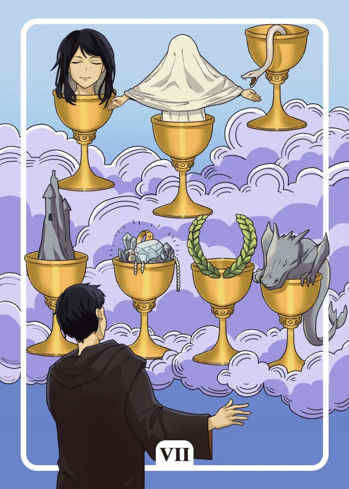

## Tarot Card Meaning
The Seven of Cups Tarot card admonishes us to be careful with what we wish for. All the wishes we have should make us happier.

However, we often find it difficult to distinguish between long-term and short-term happiness.

Material wealth, for example, is a desirable goal in life for many people, as they believe it will free them from all earthly worries.

However, wealth alone does not make people happy; on the contrary, it often leads to even more fears and worries that one’s wealth could disappear again.

Deep and long-term happiness is not for sale but comes from ourselves, by sharing compassion, generosity and cheerfulness with our fellow human beings.

The Seven of Cups indicates that we are facing an important decision in life. Especially at the beginning of new phases of life, we must choose between a wide range of options.

Consider all positive and negative consequences concerning your decision and weigh them carefully. The outward appearance of a choice can quickly conceal its true essence and sometimes hold unpleasant surprises in store.

Especially when making difficult decisions, let your intuition guide you and focus your attention on the long-term positive effects of your choice.

Another meaning of the Seven of Cups is that we indulge in wishful thinking and daydreaming without manifesting them in the real world.

Perhaps you dream of losing weight or becoming physically fit but without exercising and a proper diet, your body will not change.

If you want to reorient yourself professionally to earn more money, this will only succeed through appropriate training or applications.

Dreams are important because they show us what we can achieve with the right motivation. Live your dream by making a concrete decision to make it come true. Do not be afraid to invest the necessary time and energy.

### Love: Single
As a single, the Seven of Cups reveals that you are currently facing an important decision in your love life that involves several people around you.

Perhaps you have developed deep feelings for several friends around you, and right now you don’t know with whom you can imagine a long-term relationship.

When making a decision that affects your love life, always let your feelings and intuition be your first guide, as these can most honestly express the unconscious connections and energies between two people.

Instead of dancing at several weddings at the same time, you should choose one relationship and thereby stop giving false hope to the other people involved.

The Seven of Cups also shows that you are too deceived by external characteristics when choosing a partner.

Often we present ourselves in the partner search quite differently than we really are to impress our counterparts. But the more we pretend, the sooner this illusion will vanish into thin air.

Pay attention not so much to external or material advantages of your date, but to what extent your date behaves sincerely and authentically.

### Love: Relationship
In a relationship, the Seven of Cups signals various unfulfilled desires in a partnership. Such desires can include different areas and put a significant strain on the relationship if not taken care of.

First of all, not only keep your wishes regarding the partnership in your head but share them with your partner.

Do not formulate your wishes as a reproach but to present them as an enrichment of the relationship.

Together you can see to what extent a realization is possible and how you specifically want to live out your wishes. Another aspect of the Seven of Cups Tarot card in a relationship is that we make unrealistic illusions about our partnership or love in general.

Such illusions can be, for example, that a good relationship knows no quarrels or that we can completely re-educate our partner the way we would like him to be.

If such unrealistic illusions are enforced, by all means, they inevitably lead to strong tensions and disharmony between the partners.

Accept that a relationship cannot be squeezed into simple schemes and pipe dreams but requires acceptance and respect for the partner from both sides. With that in mind, you can live a long-term and happy partnership.

### Health

For your health, the Seven of Cups means that you should not burden yourself with too many things at once. There is a danger that you will quickly become overloaded, which will harm your health.

Decide instead on a project which you pursue with all your strength and put other things on the back burner for the time being.

Furthermore, the Seven of Cups stands for being especially cautious with too seductive promises of healing.

If someone offers to heal so far incurable illnesses, you should become clairaudient and rather take distance. Because often the true motives of such “healers” are to earn money from the suffering of others instead of curing diseases.

### Career

For your career, the Seven of Cups means not blindly chasing a dream job. On closer examination, such a job can have considerable disadvantages, such as loss of income or a complete change of residence.

Therefore, do not chase after illusions, but look for jobs that are the best compromise for you in the overall package.

In addition, the Seven of Cups stands for an upcoming professional decision that will have a great impact on your working life. That may include a job change or transfer to a new department.

It’s best to make a pros and cons list, weighing the pros and cons of your choices.

Upright Seven of Cups Finances/Money Meaning

For your finances, the Seven of Cups means that you finally want to fulfill long-awaited material desires.

Even if you have just saved some money, you should not spend it all at once. Treat yourself to one or two purchases and rather put your remaining money aside for difficult times.

Another meaning of the Seven of Cups is that an important investment decision (new loan, car) is coming up. While you have a wide range of options, not every choice is worth the money.

Therefore, don’t be blinded by great promises or prices, but inform yourself in advance about the individual advantages or disadvantages of the respective alternatives.

### Destiny 

As a fate card, the Seven of Cups reveals that you have to choose between different desires in life.

Keep in mind that each of your desires can have positive and negative outcomes. Therefore, weigh well in advance which dreams you want to fulfill and what consequences they will have for your life in the long run.

### Personality
The Seven of Cups represents a personality that has difficulty making a decision. Because of several alternatives he is often overwhelmed and postpones his choice again and again.

In addition, the card characterizes a person who likes to build castles in the air and dwell in them. His own illusions prevent him from putting his wishes into practice.

### Past
A decision from days gone by is still bothering you. Even if you cannot turn back time, you have gained an important experience.

Often you imagine your past and wish it back. However, you are under an illusion if you believe that everything was better in the past.

### Future
You are running away from an important commitment from your past. But ignoring it won’t make it go away forever.

Not so long ago, your life was much more structured than it is now. Try to remember how you got everything together then.

### Yes or No
You eagerly wish for a clear decision regarding your concern. But your mind is clouded by many illusions, which make a clear view of things almost impossible. Therefore, be content with a no and sort out your thoughts and expectations.