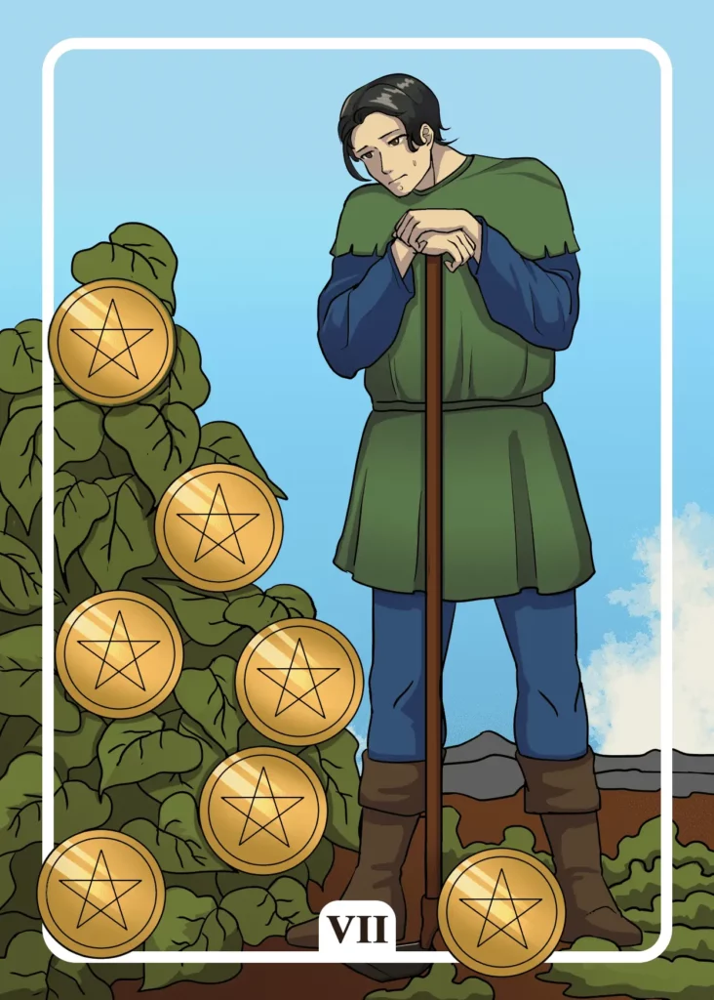

## Tarot Card Meaning
The Seven of Pentacles encourages you to be persistent and persevering for your goals in life. Patience and a long-term perspective are most likely to lead you to your goals.

They further motivate you to stick to your plans despite recurring obstacles and stay on your path in life.

Just as a farmer cultivates his plants throughout the year and has to react flexibly to the adversities of the weather to obtain a rich harvest, you have to pursue your goals with perseverance.

If you manage your energy and strength well in the long run, you will never run out of breath on your path and you will be richly rewarded in the end.

Another characteristic of the Seven of Pentacles is that you must be willing to invest energy and time in your endeavors if you want to see success at some point.

No pain, no gain! This old saying shows that the principle of cause and effect is still valid.

Put in the appropriate energy and effort to achieve your goals and you will soon be able to see the first successes of your actions.

Start to act and get to work! Only with sufficient commitment, your wishes will become true.

The more time and energy you are willing to invest, the sooner you will reap the fruits of your labor, but be careful and do not spend too much of your strength.

The Seven of Pentacles Tarot card shows you how much your actions and actions affect the environment around you. Especially when you are pursuing a long-term goal, you often don’t see the progress you have already made at the beginning because you only focus on the result.

By noticing the small changes around you, your sense of self-efficacy increases and you are much more motivated to continue on your path to the end.

Seeing the first concrete plans sprout from a tender idea, which in turn grow into concrete actions, is an incredibly beautiful experience that shows you that you have it in your own hands to change the world around you according to your wishes and dreams.

### Love: Single
In a Love Tarot reading, the Seven of Pentacles symbolizes the importance of perseverance and persistence in your search for a partner.

Do not let small failures or rejections throw you off track. Instead, use your experiences in love to further develop your seduction skills. By doing so you will find your dream partner in the long run.

Because only those who know the ups and downs of love and still persistently continue their way to find True Love will be successful in the end.

Furthermore, the Seven of Pentacles reveals to you as a single that you must be willing to invest some time and effort to find a partner that suits you.

If you just sit at home and wait for your prince charming to walk in the door, you will be disappointed.

However, use your time wisely to get the best out of yourself both internally and externally. Your chances of meeting a new partner will automatically increase.

### Love: Relationship
In a relationship, the Seven of Pentacles represents a change in your life together. Your partnership changes over time from a tender bud of infatuation to a strong trunk of unity and affection.

Through the many challenges you face as a couple in your everyday life, your life together also changes, in the sense that you have to better align your skills and strengths with each other or show the willingness to adapt to new life circumstances.

Take time now and then to consider all the positive transformations your relationship has undergone over time.

The Seven of Pentacles also encourages you to enjoy the fruits of your life together. These can be your own children, house or other dreams that you have built together during your partnership.

All the time and work you have invested will now pay off double and triple and give you many happy moments that you will enjoy for a long time to come.

Especially in times of crisis in a partnership, it helps to realize together what you have already achieved together. Realize how valuable your relationship is by looking at the beautiful moments you both experienced.

### Health

For the improvement of your health, the Seven of Pentacles encourages you to set concrete goals. For example, you could try to lose a few kilos or to exercise regularly every week.

It is important to plan and prepare exactly how you integrate your
new routines into your everyday life. It is best to create a small book with specific time and place information. That will help you achieve your daily goals.

Another aspect of the Seven of Pentacles is to check the progress of your health-promoting routines (diet, exercise).

On the one hand, you can see how far you have already reached your goals. On the other hand, it will allow you to make adjustments to reach your goals faster.

### Career

Professionally, the Seven of Pentacles shows that your efforts at work are starting to pay off. Your experience and skills open many doors for your career path.

Dare to strive for higher positions or ask for a salary negotiation so that your performance is rewarded accordingly.

Another meaning of the Seven of Pentacles is that you should not slacken your efforts to obtain your dream job. Perseverance often leads to the goal if you prepare yourself accordingly.

Take advantage of any qualification that will bring you closer to your desired job. Even with initial rejections, you should continue to apply, showing your desire and motivation for your dream job.

### Finances/Money 

In financial matters, the Seven of Pentacles stands for the fact that patience and perseverance are the surest way to prosperity.

A monthly savings plan of 100 or 200 dollars doesn’t sound like much at first. However, after ten years you will already have saved a considerable sum. The key here is not to spend the money prematurely and to stick to your own savings targets.

The Seven of Pentacles also indicate that you should consider how to invest your assets over the long term. You will have to invest some time and work in the beginning to find out the best investment for you.

As soon as you have decided on a strategy to invest your money, you will observe how your wealth increases.

### Destiny 

As a destiny card, the Seven of Pentacles stands for years of effort finally paying off. Through your diligence and dedication, you can finally reap the fruits of your labor.

Use your accumulated experience to sow the seeds for further projects. You will see that this time your fruits will ripen even faster.

### Personality
The Seven of Pentacles represents a persistent personality in all respects. He does not rest in his efforts until he reaches his goal, no matter how long it may take.

At the same time, it shows a character willing to invest time and energy in his endeavors. His dedication enables him to surpass himself and is the guarantor of further success.

### Past
Your perseverance in the recent past has brought you far. Always take it as encouragement for your upcoming endeavors.

You have invested a lot in the past to become the person you are today. Always remember what efforts were involved and appreciate your successes.

### Future
In order for something decisive to change in your life in the future, you have to become active yourself. Thus you are the creator of your own destiny.

Soon you will be able to receive the reward for your efforts. Keep working on your project and don’t let yourself be distracted by anything.

### Yes or No
It is worth investing some time in your question to get the best possible solution.

There is already a lot to be said for a definite yes, with which you can sustainably change your everyday life for the better. However, this also requires a little effort on your part.

