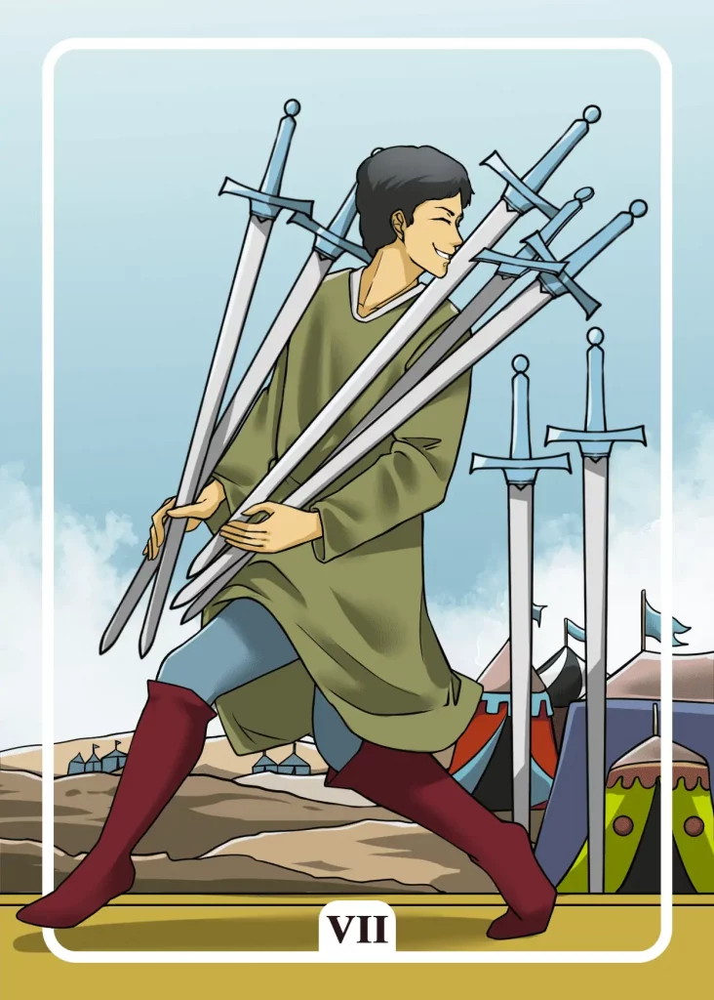

## Tarot Card Meaning
The Seven of Swords card shows that you are trying to deceive someone around you and gain an advantage from it. In certain situations, like job interviews, it can be helpful not to reveal your true motives immediately to reach your goal faster.

Keep in mind, however, that any attempt at deception carries the risk that your true intentions will be exposed and you will have to bear the consequences accordingly. In addition, you risk to shaken the basis of trust with the other person, which can lead to a rupture in the relationship.

By being honest, you may take a little longer to achieve your goals, but you will have a clear conscience and can maintain the relationships around you.

Another characteristic of the Seven of Swords is that you run away from the consequences of your actions. If you have made a mistake or done something wrong and take flight, you will have to live constantly with the fear of being called to account.

Such fear can become very overwhelming over a long period of time and is your constant companion in the form of a “guilty conscience” that constantly reminds you of your wrongdoing in everyday life.

By taking responsibility for your actions and facing the consequences of your deeds, you will always have a clear conscience and can enjoy your everyday life without worrying about being called to account.

The Seven of Swords signals that you should plan your goals strategically in advance. Good preparation will often save you a lot of time and effort later on in your endeavor, and you can plan from the start what obstacles you might face and how you will deal with them.

Just like the thief on the Tarot card, you need to consider many details in advance to make your plan a success, although you need some luck to make your venture a success.

Of course, you cannot control every eventuality from the beginning, so it is essential to keep your plan flexible and have the possibility to back out in case of an emergency.

### Love: Single
In a love tarot reading, the Seven of Swords admonishes you not to let yourself be deceived or deceive someone when looking for a partner.

We often present ourselves in a way that we seem to be the most attractive to our counterpart when we first meet him and try to hide our weaknesses.

But already after a short time, the deception often flies up so that a more intense relationship can hardly develop.

If, on the other hand, we act honestly from the beginning and do not pretend, we have a greater chance that a longer-term partnership will develop from a date.

The Seven of Swords also encourages you as a single to plan your flirting and dating well in advance so that you create a good atmosphere for falling in love right from the start.

Whether it’s the right choice of clothing or the perfect place to meet, you can prepare and plan a lot of things in advance so that getting to know each other becomes an unforgettable event for both parties.

To what extent the spark of love jumps over is not plannable, but you increase your chance considerably through good preparation.

### Love: Relationship
In a relationship, the Seven of Swords reveals that your partner betrayed you leading to a deep crisis of trust in your partnership.

Stealing or abusing trust is a severe test for any relationship because it shows that your partner deeply deceived you.

Of course, it is important to consider whether your partner deceived you only once or what the quality of that affair was.

Talk to your partner again directly about the hurtful situation and clarify that you are deeply disappointed by his deceitful behavior towards you.

The Seven of Swords also shows that you would like to run away from the problems in your partnership instead of dealing with them.

However, your problems will eventually catch up with you as a couple and may not be solvable, leading to a final breakup.

Don’t be afraid to discuss the difficulties in your relationship with your partner. In the worst case, everything will remain as it is at the moment. In the best case, you will work together as a couple to overcome your problems.

### Health

For your health, the Seven of Swords means that you should get a second opinion in case of illness. Your diagnosis so far does not cover all symptoms satisfactorily.

Even if a treatment is insufficiently effective, it
is worthwhile to take a closer look at your medical history.

In addition, the Seven of Swords reveals that you are avoiding an upcoming examination. Precisely preventive examinations can stir up a lot of fears in you.

But the earlier a disease is discovered, the better the chances of cure. Therefore, turn your fear into certainty so that you can start a promising treatment at an early stage.

### Career

For your health, the Seven of Swords means that you should get a second opinion in case of illness. Your diagnosis so far does not cover all symptoms satisfactorily.

Even if a treatment is insufficiently effective, it
is worthwhile to take a closer look at your medical history.

In addition, the Seven of Swords reveals that you are avoiding an upcoming examination. Precisely preventive examinations can stir up a lot of fears in you.

But the earlier a disease is discovered, the better the chances of cure. Therefore, turn your fear into certainty so that you can start a promising treatment at an early stage.

### Finances/Money 

For your finances, the Seven of Swords means that someone is trying to deceive you. Especially when you sign a new contract or credit, you should be especially careful.

Often supposed “advisors” only earn high commissions for bad contracts. Look for trusted people with whom you can discuss your financial plans again before you put your signature under them.

Furthermore, the Seven of Swords indicate that something has been stolen from you illegally. It does not necessarily have to be pickpocketing.

Often it is also illegal fees, with which companies try to make cash. As soon as you notice such theft, you should act immediately and contact the police or a lawyer.

### Destiny 

For your destiny, the Seven of Swords reveals that someone is trying to deceive you. Keep your eyes and ears open so that you will notice the deceiving notice in time.

Sometimes, however, such experiences are unavoidable. But as long as you learn from them, it will become more and more difficult to deprive you of your possessions.

### Personality
As a personality card, the Seven of Swords represents someone who is very strategic in all his actions. He always has an elaborate plan to achieve his goals and leaves nothing to chance.

Likewise, the card indicates a character who deceives others and prefers to keep his true intentions hidden.

### Past
You are running away from some obligations of your past. However, you will not be able to hide from them forever.

Looking back, some people have disappointed you very badly. Learn from these setbacks and find out why you fell for such people.

### Future
You have some difficult tasks ahead of you. You should therefore prepare a well-thought-out strategy that will enable you to reach your goal safely.

In the near future, someone may want to steal from you. That can mean not only material things but also intellectual property.

### Yes or No
This matter is much about deception. But don’t let it cloud your senses, and prepare an appropriate strategy.

A yes answer will help you to see more clearly and, at the same time, reveal a favorable opportunity for you to move forward.