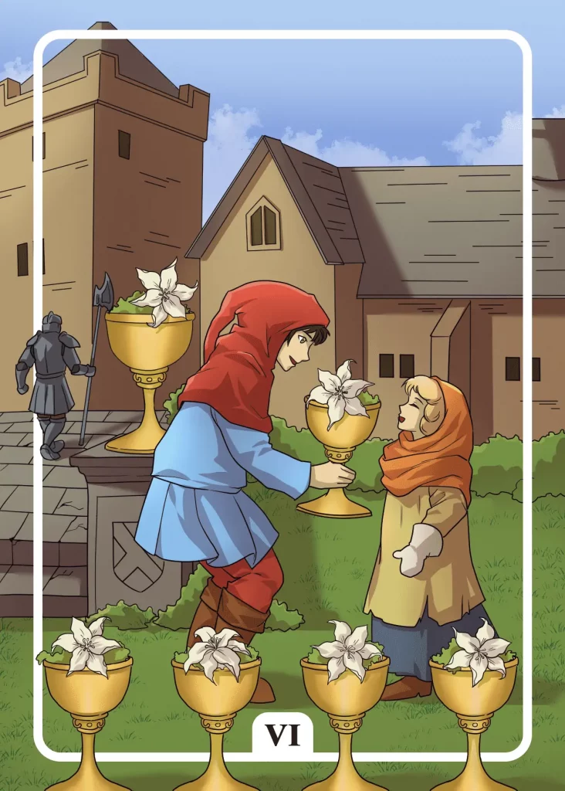

## Tarot Card Meaning
The Six of Cups reveals a beginning time of harmony and joy in your life. Your inner attitude plays a decisive role in the extent to which you can accept these Cups of Joy presented to you.

Only if you are free of ulterior motives and doubts, you can enjoy happiness and harmony to the fullest.

When you receive a gift, whether material or mental, be grateful for it and share your joy with the giver.

By being kind-hearted yourself and giving small attentions to those around you without ulterior motives, you will notice how much happiness returns to you.

The Tarot card Six of Cups encourages us to get back in touch with our inner child. That includes looking at everyday life from a child’s eyes and enjoying life like a child, naturally and without any worries.

Try things again that you enjoyed as a child, such as climbing trees, building Lego or simply painting something.

Feel again the inner joy and freedom that you experienced as a child and forget at least for the moment worries and burdens of everyday life. You gain new energy and happiness when you see the world through the eyes of a child.

By getting closer to your inner child again and allowing it to be part of your everyday life, new access to your intuition and creativity will open up.

Another meaning of the Six of Cups is to become aware of and strengthen our childlike qualities. Unfortunately, today childlike behavior is often dismissed as naivety or nonsense.

But childlike qualities such as curiosity, impartiality and pure joy of life help us ‘get through’ difficult times.

Often it helps to remember our childhood, when the world was still full of adventure and mystery, and to revel in these memories so that we can experience our childlike side anew.

Direct contact with children can also help us to experience the world again from a refreshing perspective and joyfully, simply by actively listening to children and sharing their natural lightheartedness and joy.

### Love: Single
In a love tarot reading, the Six of Cups reveals that someone is granting you a special gift. As a single, this means that someone close to you will give you their affection and love in various ways.

In any case, accept this gift with an open heart and gratitude and share your joy with your counterpart.

Even if this connection does not result in a new relationship, it can still give you a lot of security and closeness. The Six of Cups encourages you to be open and kind.

Through openness and good-heartedness doors will open to you all by themselves to people who before were perhaps rather rejecting or closed towards you. By starting to give trust and affection from yourself, your chances for a new partnership will increase significantly.

The more you are willing to give to your environment unconditionally, the more you will get back in the form of love and happiness from the people around you.

### Love: Relationship
In a partnership, the Six of Cups reveals that you should go back to your beginnings as a couple.

Especially in stressful times in your relationship, it is important to become aware of how your love has begun.

When we first get to know each other, we usually feel the most intense feelings for each other and experience a previously unrecognized level of joy.

Bringing back these feelings to the present can enrich your relationship life very much because you become aware of how much you have already given each other in your life together.

The Six of Cups means to take children as a model for your relationship life. In a partnership, we often carry some conflicts around for years.

Children also quarrel almost every day, but they just as quickly forget why they wrangled and play together again.

That lightheartedness around arguments is a good example of how you grow stronger together as a couple. Do not bring up past conflicts over and over again, but enjoy and live your partnership in the here and now.

### Health

The Six of Cups represents that you support someone close to you in overcoming an illness for example through daily errands or just an open ear for the other person’s worries.

Through your help, you speed up the recovery process of your loved ones and give them moments of bliss in a difficult time.

Furthermore, the Six of Cups stands for
a return to childlike qualities in health matters.

Rediscover your natural urge to move and enjoy the here and now. Thereby you rediscover your body and regard your health as a valuable gift, which you should cherish and care for.

### Career

In professional terms, the Six of Cups stands for good teamwork at your job. You form a unit with your colleagues. Together you cope with the most difficult requirements at work.

Mutual appreciation and support when one of you gets stuck are the cornerstones of good cooperation, which benefits everyone involved.

In addition, the Six of Cups stands for letting our childlike qualities flow more into work. Childlike curiosity, for example, lets you discover new ideas that can enrich work processes.

In turn, a certain naivety can help you look at problems from a different angle and try out new approaches to solving them.

### Finances/Money

In terms of your finances, the Six of Cups represents an unexpected windfall that will bring you much joy. Perhaps you win an amount in the lottery or receive a bonus at work.

Share your joy about it with people close to you because money alone does not make you happy, but only if you share it with your fellow men.

In addition, the Six of Cups stands for the principle of giving and accepting in matters of money. If you have enough wealth, you should share it with those who do not have so much wealth in life.

Conversely, in times of need, you should be able to accept financial help to get back on your feet.

Keep in mind that both scenarios can happen to you in life, so you should firmly establish the principle of giving and receiving in your daily life.

### Destiny

For your destiny, the Six of Cups means that you should practice compassion for people in your social environment.

If you offer your help and support without ulterior motives, you will experience true joy resulting from altruistic behavior. Moreover, in times of need, you can rely on the support of your fellow human beings.

### Personality
The Six of Cups describes a good-hearted character trait. The person does not only think about his own needs but also cares about the needs of his fellow men.

Moreover, this is someone who sees the world through the eyes of a child. Such a person holds few grudges and has retained their innate curiosity.

### Past
Keep your innocence from days gone by. Thus you will always have a clear conscience even when making difficult decisions.

Even if your childhood was a while ago, you should go back in your mind every now and then and remind yourself of the valuable qualities of your inner child.

### Future
You will soon experience a time of joy. The people around you will give you a happy event which you will remember for a long time.

Your kindness will be rewarded many times over in the near future. Continue to be faithful to your path and keep your big heart.

### Yes or No
Your inner child already gives you a positive basic feeling with your question. Decide for a yes and your joy about it will be boundless.

Under certain circumstances, you and your fellow men benefit from your choice so that you can share your happiness.