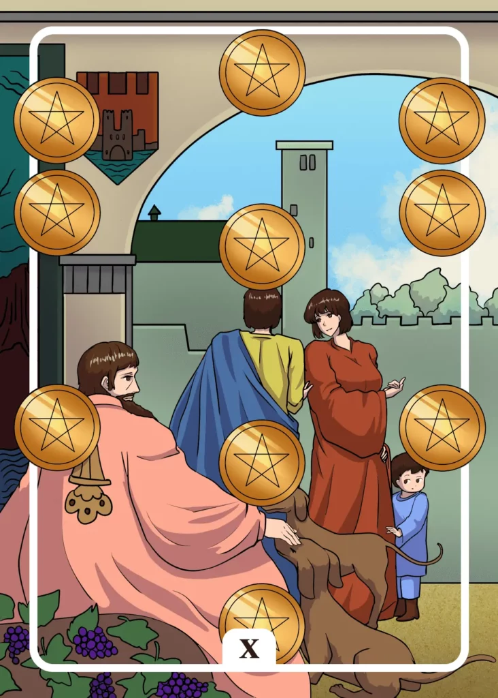

## Tarot Card Meaning
The Ten of Pentacles represents a high level of influence and prosperity you have earned throughout your life.

In various areas of your life, your opinion is highly sought after and respected, which enables you to influence many decisions in your favor.

In addition, you recognize the high responsibility you have due to your respected position and try accordingly to direct your words and deeds for the good of the community.

The wealth you have built up gives you a deep sense of fulfillment and security. It is above all the wealth of your relationships in the form of friends and family that makes you look contentedly into the past as well as into the future.

Another aspect of the Ten of Pentacles is the return to old traditions and values. You know your family history very well and have learned a lot from it for your own life path.

Common traditions connect the whole family and create an incomparable feeling of togetherness, which in turn gives rise to loyalty and gratitude.

Especially in our time, where even fixed values are becoming more and more fragile, you have solid principles of life that help you to orientate yourself in a constantly changing world.

Such values mostly come from our ancestors, who were successful with them in their time. Always keep the memory of your ancestors alive and honor the achievements and burdens they took up for you and your family.

The Ten of Pentacles Tarot card encourages you to develop and implement a life plan. No matter how old you are or may feel, it is always worthwhile to have goals in life and pursue them. Such projects give you orientation in life and encourage you to actively work on your dreams.

It is important to have both short-term and long-term goals. Especially projects that extend over a long period of time must be divided into small subgoals so that you remain motivated by recurring partial successes.

Always keep your dreams and desires in mind, even if they seem far away at the moment, and you will wake up one day and realize that your goals have come true.

### Love: Single
As a single, the Ten of Pentacles reveals that you have a good chance of finding a new love due to your good reputation and corresponding influence in your social environment.

Your good reputation will help you to develop a positive relationship with new dating partners. Such a good foundation will give you a high chance to intensify your relationship on later dates.

Use your influence and contacts to meet new interesting people and keep networking. Then you will have a wide range of contacts where one of them could be True Love for you.

The Ten of Pentacles indicates that you are very wealthy in different areas of your life. Only in the area of love you are looking for a suitable partner to complete your happiness.

Don’t be afraid to use your wealth in dating to give your date and yourself wonderful moments.

Also, share your inner wealth with your counterpart and reveal your valuable character traits, such as loyalty and caring, so that you can win his or her heart.

### Love: Relationship
In a partnership, the Ten of Pentacles stands for the same traditions and values that you have built up as a couple. Each of you has brought customs from your own families into the relationship and enriched it with them.

In addition, you have created your own culture of living together, in which you combine and re-experience the sometimes different values of your families of origin.

Your sense of tradition helps you to stay grounded even in turbulent times. It can also help you to take the right direction on your life path.

Furthermore, the Ten of Pentacles shows that you have the same life goals as a couple that you consistently pursue. Visions in a partnership strengthen your cohesion and trust in each other so that you always have an orientation in difficult times.

To dream alone is already pleasant, but to share and realize your wishes with your partner is a unique experience that will give you both deep fulfillment.

### Health 

The Ten of Pentacles reveals that it is worthwhile to work on your health in every phase of life.

No matter how young or old you are, if you regularly do something for your body and mind, you will be less affected by diseases in the long run. The important thing is to start simple and gradually integrate a healthy lifestyle into your everyday life.

In terms of diseases, the Ten of Pentacles indicates possible family history. In any case, you should go through your family history again to find possible risk factors.

In this way, you can have a preventive examination and thus reduce the risk of serious illnesses.

### Career 

Professionally, the Ten of Pentacles represents a secure job that will support you and your family for a long time. Use your employment to provide wisely for the future, so that you don’t have to worry about money in old age.

Honor your work by always doing your best. Your job guarantees you and your family a comfortable standard of living.

Another aspect of the Ten of Pentacles is that you carry on a family tradition professionally. One way to do this is to take over or join the family business.

Another possibility is that you choose your profession based on your parents or grandparents’ work and thus profit from their experience.

### Finances/Money

For your finances, the Ten of Pentacles indicates great prosperity that you have built up over the years. Use the experience you have gained over time to make wise decisions in the future.

It is important to set the course for your financial prosperity early so that you do not have to worry about your money later.

Another characteristic of the Ten of Pentacles is, that you should think about your retirement planning. Find out about different offers that you can take out early on to supplement your pension.

The more diversely you are financially positioned in old age, the more options you will have later in retirement. You can then retire earlier or reduce your working hours without fear of poverty in old age.

### Destiny 

For your destiny, the Ten of Pentacles encourages you to return to family values. A meeting in the closest family circle can help to strengthen the bonds between you.

Because together you can enrich each other’s lives with support and experiences.

### Personality
The Ten of Pentacles reveals a character who places a lot of value on traditions in life. They form the foundation of his thinking and give him structure and security in everyday life.

It also describes a person always looking for new goals in life. He implements each of his plans with confidence and then strives for further challenges.

### Past
Your own traditions, which you have built up in your past, decisively determine your further path in life. They are an expression of your rootedness.

Use your influence from past times to open up new possibilities. Old connections are often much stronger than new ones.

### Future
Soon, you will enjoy a period of material or spiritual prosperity. Be sure to cherish such times, as they will not last forever.

Your life goals will soon change in an unexpected direction. Follow them to your true destiny.

### Yes or No
Look at how you have decided in similar situations so far. Your answer tendency is the product of many previous weighing processes.

Your inner voice clearly advises you to say yes, which has a certain tradition in such cases.

