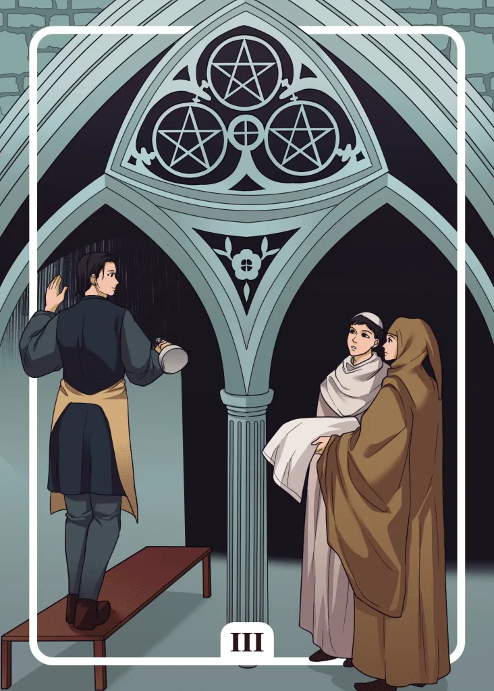

## Tarot Card Meaning
The Three of Pentacles Tarot card represents the pooling of various competencies to achieve a great goal in life. To build a cathedral requires many different professions working together to create a great architectural miracle.

In everyday life, it is often similar, for example, if you have a big project in your job, you will only be able to put it into action with the help of the competencies of your co-workers.

By dedicating each individual to a specific part of the common project in terms of his or her strengths and skills, you will be able to overcome challenges that would not be feasible as a single person.

The Three of Pentacles also symbolizes that you are moving up to the practical level in the realization of your goals and objectives, where you are putting into action the plans you have made.

You already have concrete ideas and steps to implement them, so now you should dare to take the first steps towards practical realization.

Maybe you have already achieved partial success and your goals are slowly taking shape. In any case, it is important during the implementation of your plans to adapt them to the current state of your project and, if necessary, to drop some aspects and replace them with new ones.

As your project progresses, you will notice how your well-planned preparations bear fruit, which you can now harvest with pride.

Another aspect of the Three of Pentacles relates to learning from those around you to further enhance your skills.

Whether from work colleagues, friends or family members, everyone around you has expertise in certain areas from which you can learn a lot for yourself.

Learning only takes place through mutual exchange, which is why you should regularly exchange information with those around you about the competencies in which you would like to develop further.

By doing so, you will show great interest and appreciation for the other person’s skills and at the same time strengthen the relationship between you in a positive sense.

### Love: Single
As a single person, the Three of Pentacles reveals to you that you should go out looking for a partner with a concrete plan so that you can go into your dates as confidently as possible.

It is not dramatic if you cannot control every little thing. Rather, you must think about the framework of your dates such as place and time beforehand and prepare it well.

Because in love affairs many unexpected things happen. By conscientiously preparing the cornerstones of your date in advance, you will be able to start your date with great aplomb and self-confidence.

Furthermore, the Three of Pentacles encourages you to use your skills and abilities in an appropriate way for dating. During the first date, we often talk about our hobbies and skills and try to impress the other one.

However, instead of just falling into profane boasting, you should think carefully about the everyday situations in which your skills could be of advantage to you and your partner.

By listening carefully to your partner and noticing where he/she has weaknesses in everyday life, you can try to compensate for them with your skills and thus help him/her in perspective.

### Love: Relationship
In a partnership, the Three of Pentacles stands for very good and intimate cooperation between you as a couple.

When problems arise, you understand each other almost wordlessly and everyone knows exactly what role they have to fulfill. As a team, you successfully master the challenge in front of you.

You use your skills to compensate for each other’s weaknesses. Good teamwork involves excellent communication, both verbal and non-verbal so that you can always coordinate your actions.

The Three of Pentacles card encourages you to learn a lot from and with your partner. Especially in a very close relationship, you get to know each other’s strengths and weaknesses.

You benefit from each other’s knowledge and learn a lot for yourself and also for your relationship.

The more you know about your partner and the more you learn new skills together, the more you can face new challenges in life with competence and solution-oriented.

### Health 

The Three of Pentacles reveals that you are the designer of your health and well-being. Your efforts to increase your fitness are slowly paying off.

You feel more vital and efficient than ever before. If you keep up your diligence, you will enjoy good health in the future.

Another aspect of the Three of Pentacles is that you should get support regarding your health. If you want to improve your health, it is advisable to contact a fitness trainer or nutrition coach.

Experienced advisors will make it easier for you to start a new health program and prevent you from making mistakes.

### Career

In a career context, the Three of Pentacles represents extraordinary diligence and dedication in your job.

Your exemplary work ethic will leave a good impression on both your colleagues and superiors, so you can count on their support. You have a promising career ahead of you, which you have worked hard to achieve.

Furthermore, the Three of Pentacles encourages you to continue your education and expand your professional skills. Your additional knowledge will simplify your work and let you generate new ideas and solutions.

Moreover, you can share your new skills with your colleagues, so that your whole company will benefit from them.

### Finances/Money 

In financial matters, the Three of Pentacles encourages you to plan and structure your money investments. If you start thinking early about how to provide for your old age, you won’t have to worry so much about your finances later on.

Make yourself a 5 or 10-year plan in time, with concrete financial goals that you want to have achieved by then.

Furthermore, the Three of Pentacles encourages you to expand your knowledge about money and finance. Inform yourself from various sources such as the Internet, bank advisors and friends about ways to manage your money wisely.

From this pool of experience, you can then create an individual strategy for your finances, with which you can work calmly.

### Destiny 

As a destiny card, the Three of Pentacles reveals, that through diligence and ambition you can make your dreams come true.

The basic framework of your plan is already in place, but there is still a lot of work to be done before you achieve the desired result. Keep on working diligently and your vision will soon become a reality.

### Personality
The Three of Pentacles stands for a planful character trait. The person always has a well-thought-out strategy for achieving his goals, with the help of which he can safely master his plans.

At the same time, the card describes a person who can work well with others. They are careful to share their skills with others to achieve their goals more quickly.

### Past
In your past, you could learn a lot from different people. It doesn’t matter if the lesson comes from a child or an older person.

Until now you have always lived your life according to your inner plan. Look at the milestones you have already achieved.

### Future
For future challenges, you should definitely look for other comrades-in-arms. With their help, you will easily overcome upcoming obstacles.

In the near future, you will have to use all your skills to solve a difficult task. But you already have the solution inside you.

### Yes or No
Your matter requires a planned and well-thought-out procedure. You have all the competencies within you that you need for this.

What are you waiting for? With a confident yes, you can quickly relieve yourself and tackle the tasks ahead of you.

