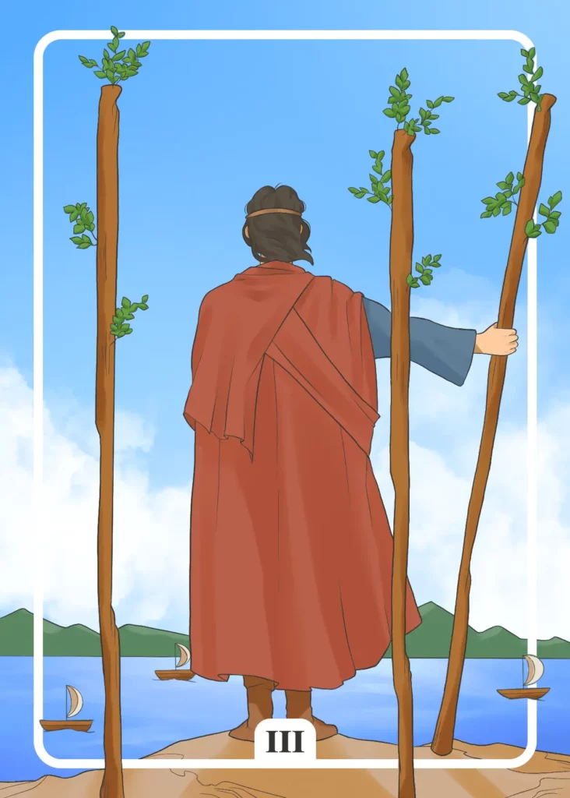

## Tarot Card Meaning
The Three of Wands encourages you to leave your comfort zone and expand further in different areas of life.

The ocean on the card symbolizes the endless potential that lies in new adventures and challenges, allowing you to mature personally and expand your knowledge and skills.

It is now time to leave your safe harbor and set out into previously unknown waters, be it in love, at work or in your free time.

Don’t be afraid of possible storms or other adversities, as you have already acquired enough knowledge and skills to sail around even the most difficult obstacles and expand your abilities.

Another meaning of the Three of Wands is the need to carefully weigh upcoming challenges or decisions and make appropriate preparations in advance to ensure successful outcomes.

The ability to plan ahead and act accordingly enables you to anticipate foreseeable problems and to prepare yourself well against the storms of life.

Every success of a journey you undertake in life always depends decisively on how well you are prepared for it.

Therefore, plan your plans in time and meticulously so that you do not experience any unpleasant surprises and can devote yourself to your journey and the experiences associated with it.

Furthermore, the Three of Wands Tarot card stands for the leadership qualities you possess, enabling you to achieve your goals more quickly.

Now is a good time for you to take the helm of important projects and set the direction in which the journey should go.

Use your natural charisma and persuasiveness to get those around you to join you in your plans, as you will achieve your goals much more quickly and efficiently with a few allies at your side than you would on your own.

However, a good leadership trait also includes taking responsibility and standing up for your comrades when problems or obstacles arise. Only in this way can you be sure that your fellow human beings will faithfully stand by you until the end of your journey.

### Love: Single
In a love tarot context, the Three of Wands encourages you to look for new opportunities in love that will help you find new love. Leave your safe haven and set out to explore new avenues in love.

For example, you can try out new hobbies or interests that you’ve had your eye on for a while and come into contact with new people who share your passion.

If you are willing to explore yourself and your environment, you will meet many lovely people on your journey, one of whom could be true love.

Furthermore, the Three of Wands as a single person stands for expanding your social circles so that your chances of meeting a new love increase accordingly.

It is best to think about the framework in which you could meet other like-minded people because similarities create a certain basic sympathy, especially at the beginning of a relationship. Such similarities can be the same interests, your own profession or value systems.

### Love: Relationship
In a partnership, the Three of Wands Reversed Tarot card encourages you to take the lead in upcoming projects. In a relationship, it is sometimes necessary for a partner to lead the way in certain challenges, based on their own expertise or past experience.

Try to take your partner by the hand and guide him through the task. Do not only give instructions but always have an open ear for your partner and his needs on your way.

Another aspect of the Three of Wands is that you as a couple should be aware of the long-term implications of your current goals and decisions.

Maybe you are thinking about buying a house or starting a family, plans that sometimes require a lot of foresight from you.

Because you have to estimate well which burdens will come up to you in the near and distant future and how you want to meet them together. The better prepared you are, the easier you will realize your long-term goals.

### Health 

The Three of Wands reveals that you feel the need to improve your health. Although you already feel quite fit, you would like to improve your performance.

For this, it is necessary to go beyond your usual limits. It may be necessary to travel longer distances, like for a personal trainer or a new sport.

Another aspect of the Three of Wands is that you should look for new ways of healing.

Especially if conventional remedies do not alleviate your symptoms sufficiently, you should try alternative treatments (TCM, homeopathy). These can support the healing process and have manageable side effects.

### Career 

In professional terms, the Three of Wands symbolizes a departure for new shores. That can mean a new job or the step into self-employment.

It is important to make the necessary preparations for your professional change in advance. Then you will be well prepared against initial storms or obstacles.

Another aspect of the Three of Wands is that you get a higher leadership responsibility in your company. Leading employees successfully requires a high degree of empathy on the one hand and good conflict management on the other.

As long as you behave respectfully and appreciatively towards your colleagues, they will accept your role as a leader and support you.

### Finances/Money

For your finances, the Three of Wands means that you should expand your investments. Inform yourself about alternative investments to the traditional savings account or building society contract.

Because the broader you are financially positioned, the more likely you are to protect yourself from financial crises or unexpected events. Make sure that your investments have a manageable risk and a good return.

In addition, the Three of Wands symbolizes how important it is to have a good overview of your finances. If you have a good overview of your income and expenses, you can manage your money much more flexibly.

But don’t just look at the current account balance, but also look a little bit into the future.

### Destiny

As a destiny card, the Three of Wands encourages you to set out for new shores. The world lies open before you with all its possibilities.

Have the courage and self-confidence to go on a journey and gather valuable experiences for your life. On the one hand, you will expand your horizons. On the other hand, you will have the opportunity to grow beyond your limits.

### Personality
The Three of Wands reveals a character who loves to explore himself and his environment. His urge to explore allows him to take new perspectives and constantly expand his knowledge.

Likewise, a leader is described here. The person can convince others of his vision and motivate them to cooperate.

### Past
Periodically explore your past and look for situations in which you rose above yourself to learn from them.

In the recent past, you had to take over some leadership tasks, which you mastered well. That has also changed you as a person in a positive way.

### Future
When faced with a challenge, you should act with foresight. The future consequences of your actions should not be underestimated.

Shortly, you will have the opportunity to significantly expand your skills. Be prepared to develop your knowledge.

### Yes or No
In this matter, wise foresight is important so you can estimate the future effects of your choice better.

At the moment, everything speaks for a clear yes, because you have the opportunity to develop yourself and expand your knowledge and skills.