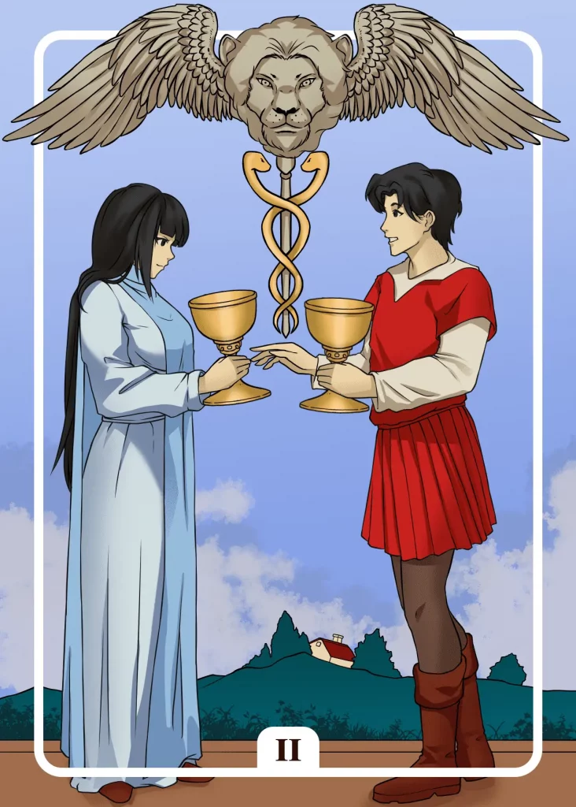

## Tarot Card Meaning
The Tarot card Two of Cups reveals new connections that will enrich your life. Such relationships can occur both in the private and professional spheres. They can awaken previously unused potentials in you.

It is not necessary that you swim completely on the same wave with the corresponding person, but rather that you complement each other in your ideas and conceptions.

Criticism is an important pillar of your relationship. It helps you both to grow beyond yourselves and to realize joint projects. Over time, deep trust will grow between you, enabling you to join forces to overcome even the most difficult challenges.

Another aspect of the Two of Cups is the presence of a strong emotional attraction. Such an attraction can be both positive and negative in nature.

Positive means that you are attached to a person on a deep, emotional level, for example, a friend or family member or even a pet.

This attachment also emanates from your counterpart and provides you with a deeply fulfilling relationship characterized by mutual trust and love.

Negatively speaking, an attraction to a person is when it turns into a kind of one-sided dependence. The other person does not reciprocate your feelings to the same degree and uses the relationship only for their benefit.

The Two of Cups symbolizes the importance of intensively cultivating existing partnerships in the professional and private spheres. Try to find out which relationships have the most potential for the future and in which there is mutual appreciation and acceptance.

It is more favorable to maintain rather few but intensive friendships. The latter stand by you in difficult life situations and give you emotional support.

Too many relationships, on the other hand, bear the danger that you do not really know most of your acquaintances and that they will distance themselves from you in case of emergency.

### Love: Single
The Two of Cups reveals in a card reading that you will soon find a partner in your life. Perhaps you have felt for some time that an initial friendship or acquaintance will gradually develop into something more serious.

Be ready to take the opportunity to reveal your feelings to your partner. You can become active yourself and create a suitable atmosphere through a rendezvous, where you offer each other your cup of love.

Giving trust and love and receiving it in return is a great gift that you should handle very carefully and gratefully.

The Two of Cups Tarot card shows a strong physical and mental attraction that a person has on you. You can think of nothing else but this person and you have the well-known butterflies in your stomach.

Observe your counterpart to determine whether this attraction also emanates from his side. Dare to take the first step and reveal your feelings to him as soon as your inner voice confirms that you are both attracted to each other

### Love: Relationship
In a relationship, the Two of Cups stands for a very intense connection between two people that goes beyond the measure of a normal partnership. Such a connection is noticeable because you often have the same thoughts and feelings without prior agreement.

The word soul mate is used as a synonym when two people understand each other wordlessly and know exactly what the other is thinking. Be grateful that you and your partner have such a deep and intimate connection because it shows how strong and solid the bond of love is between you.

Another revelation of the Two of Cups is that you both have an excellent fit on a spiritual level. Because of your different qualities, you have a high attraction to each other that will outlast even difficult times and hold the potential for a lifelong fresh love relationship.

Your different talents allow you to work synergistically and complement each other. Together you can overcome any challenge in life.

### Health

For your health, the Two of Cups advises you to promote your health with a friend or your partner. Exercising together or fasting together has great motivational benefits.

You can share problems and celebrate successes together. And in any case, the two of you will improve your health.

Another aspect of the Two of Cups in health matters is that your well-being depends to a great extent on the social contacts you maintain.

The best prevention against many mental illnesses is a stable social environment, which supports you and can catch you in times of crisis. In addition, you can always count on people to help you in case of illness.

### Career 

For your profession, the Two of Cups Tarot card reveals that you have a very close relationship with a colleague. You work very well hand in hand and can blindly rely on each other in any situation.

Having such a collegial relationship is something very valuable that you should guard and cherish like a treasure.

In addition, the Two of Cups can indicate a new business relationship that will prove to be very beneficial for both parties. Both parties can learn a lot from each other and set mutually creative processes in motion.

The seed you sow at the beginning will soon bear fruit and your professional position will improve as a result of the relationships you enter into.

### Finances/Money 

For your finances, the Two of Cups means the necessity of a trusting partnership. An insurance or bank consultant should also swim with you on a human level.

Especially when it is about a lot of money, like loans, you have to trust your counterpart regarding his motives and competence.

Also, the Two of Cups means that your finances are in a very stable phase right now.

Your prosperity allows you to concentrate on things in life that are worth more than money, like love and family. You can enjoy such intangible luxuries more easily when you have no financial worries.

### Destiny

As a fate card, the Two of Cups reveals an upcoming partnership that will enrich your life. Such a connection can appear in many forms and you should honor it as a very special gift.

But a good partnership, both in business and in love, always takes two. Therefore, work actively to maintain and strengthen your connection.

### Personality
The Two of Cups represents a person with a high need for commitment. She likes to establish and maintain relationships with other people.

Furthermore, the Two of Cups represents an overly caring and loving character. The person wants everyone around him to be well and shares the great love in his heart.

### Past
You long for an intimate connection you once had a long time ago. It showed you how important a deep connection with other people is.

You are preoccupied with an ex-partner from your past. You still have strong feelings for him and want to know if he feels the same way.

### Future
Soon, you will experience an almost magical attraction to another person. That can develop into an intimate friendship or more.

The Future promises you to find a steady life partner soon. With him at your side, you will succeed in everything.

### Yes or No
You feel a high attraction to a positive decision, which can help you decisively in your matter. Your question should therefore be answered with a yes.

With this answer, you feel in harmony with your heart again and have the certainty to be on the right path.
