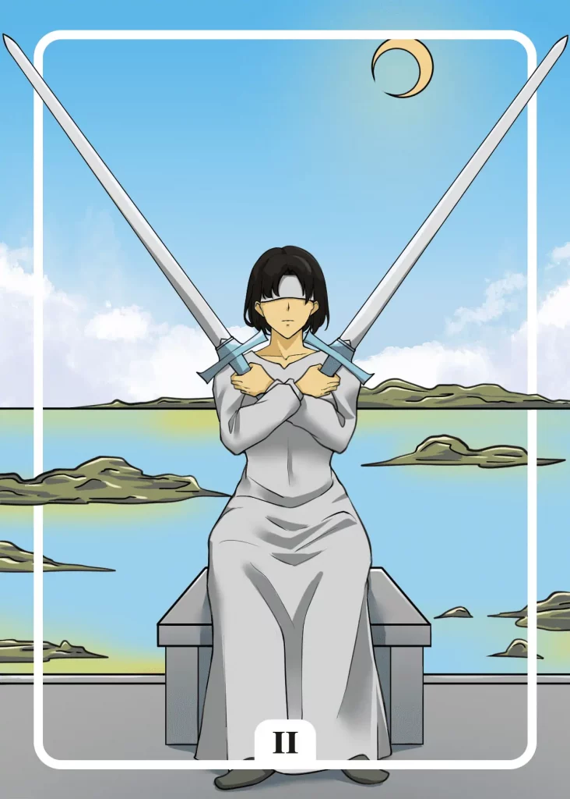

## Tarot Card Meaning
The Two of Swords reveals that a very challenging decision lies ahead of you, which weighs heavily on you and you try to avoid.

Delaying or avoiding a decision will only increase the burden you feel as if you were holding two huge swords in the air as shown on the card.

Use both your mind and your heart to finally decide so that you can free yourself from this burden.

Every path you take will have its pitfalls, but only when you free yourself from your rigidity will you be able to reach your goal. With every decision you can make, the following will become easier for you.

Another characteristic of the Two of Swords is the careful consideration of decisions. Just like the woman on the card, we are sometimes blind and can only perceive limited information of the paths before us.

The blindfold around our eyes is often just an excuse so we don’t have to face the unpleasant aspects of our choices.

But as soon as we free ourselves from the blindfold, we will discover new alternative paths that can lead us to our goal as well as the risks and dangers of our choices.

When weighing, use all the information that is available to you and consider alternatives that at first seem far-fetched because they offer usually a lot of unexpected potentials.

The Two of Swords symbolizes an inner blockade that inhibits you in your everyday life. By putting off important decisions and not daring to solve urgent problems, you run the risk that they will dominate your life.

From the moment you get up until the moment you go to bed, your thoughts will constantly be on the problems that have not yet been solved. You will not be able to tackle any new projects and will increasingly lose touch with your everyday life because you are blocked mentally.

Free yourself from such blockages by starting to face your problems and gradually dismantle them, thus you take back control of your life and move forward.

### Love: Single
In a love tarot context, the Two of Swords reveals that you, as a single, just can’t decide between two people. You are unsure with which of the two you want to go into a deeper relationship and stall both instead of making a choice.

In the long run, that leads to great dissatisfaction with the persons in question, but also with yourself, and ultimately prevents a long-term partnership with one of them.

A lot of pressure will fall off you by daring to choose a partner. You can finally take the next step towards a relationship and see if something long-term will develop.

The Two of Swords shows you that you are very blocked at the moment and cannot get out of your skin. You fear getting involved in a new partnership because you experienced suffering in past relationships.

But these wounds can only heal if you actively search for new, positively corrective relationship experiences that show you that true love is a source of joy and security.

### Love: Relationship
In a partnership, the Two of Swords signals that you are avoiding urgent issues in your relationship.

Avoiding and ignoring important decisions about living together will not make them go away but will bring them even more into focus until you can no longer avoid them.

Only when you can talk about all the urgent issues you will be able to solve any challenges related to them and tackle them together.

The Two of Swords also reveals that as a couple you are weighing important decisions that will have a significant impact on your future life together, such as family planning or a move.
Don’t just look at the short-term effects of your options, but consider the long-term consequences for your relationship. Initially, positive aspects can have very negative or stressful consequences on your relationship in the long run.

By honestly considering all the options and not ignoring the unpleasant consequences of each decision, you will find a satisfactory solution together.

### Health 

For your health, the Two of Swords means that your emotions are blocked. Such suppressed emotions can find their outlet through various physical symptoms such as fatigue or migraines.

Get to the bottom of the causes of your blockages with the help of a professional counselor. Then your body will fully recover.

Furthermore, the Two of Swords represents stagnation in your recovery process. Although you have already tried all possible treatments, there is still no relief.

Be patient! Your self-healing powers are constantly working to alleviate your
illnesses even if you don’t see it yet.

### Career

In professional terms, the Two of Swords stands for stagnation in your career. Because of the always same tasks in your job, you feel no progress in your professional life.

Don’t wait until someone assigns you new challenges, but become active yourself. You could ask for a transfer or look for professional alternatives.

Another aspect of the Two of Swords is that you are in a process of career consideration. Perhaps you have a new job in prospect and are considering whether you should give up your current job.

But don’t take too much time to consider. Otherwise, you will miss the opportunity to seize the new professional opportunity.

### Finances/Money

Financially, the Two of Swords reveals that you remain in a long-term consideration. A huge investment lies ahead of you, but it needs to be well thought out.

The various pros and cons almost outweigh each other, so you can’t come to a clear decision. Seek advice from a good friend or advisor to get new impetus for your consideration process.

In addition, the Two of Swords may indicate that you find yourself in a financial bottleneck.

Your financial room for maneuver is limited and leaves you hardly any possibilities to free yourself from your situation. Practice patience and work your way back to monetary freedom step by step.

### Destiny 

For your destiny, the Two of Swords means that you remain on an important decision. You don’t dare to choose because you fear the consequences.

But with this attitude, you are only blocking yourself. Decide so that you can act again and move forward on your life path.

### Personality
As a personality card, the Two of Swords reveals someone who weighs his decisions intensely. However, this often causes the person to lose precious time so some opportunities evaporate again.

It also means a person who tends to avoid difficult situations in life. They prefer to look for quick ways out than to face the challenge.

### Past
Something from your past is blocking you. Only you can remove the obstacle by facing it.

You are consciously avoiding the confrontation with a life issue that has been accompanying you for a long time. However, this will only make it more overwhelming.

### Future
You are facing a time of standstill. Important projects will not really get going. Use this break to recharge your batteries.

Soon, you will have to weigh up which path of life you want to take. Do not take too much time. Otherwise some ways will close again.

### Yes or No
You are still caught in a far-reaching weighing process in this question. However, this means that you are not really making any progress and are stuck on the spot.

With a no-decision, you avoid further headaches for the time being and can devote yourself to other things again.